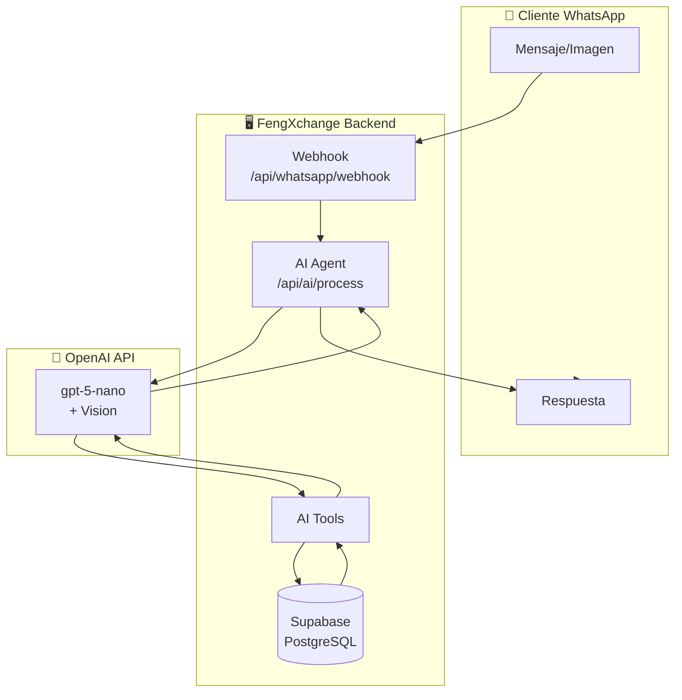

# 🤖 Plan de Implementación - Fase 7: Agente IA "FengBot" para WhatsApp

> **Versión:** 3.1 (Enfoque Híbrido de Seguridad)  
> **Fecha:** 1 de Febrero, 2026  
> **Modelo:** OpenAI gpt-5-nano (con Vision)  
> **Objetivo:** Asistente inteligente bidireccional para WhatsApp Business API

---

## Skills Aplicadas

Este plan está refinado siguiendo las mejores prácticas de las siguientes skills:

| Skill | Aplicación |
|-------|------------|
| **api-design-principles** | Diseño de endpoints REST, versionado, error responses |
| **nodejs-backend-patterns** | Layered architecture, dependency injection, error handling |
| **supabase-postgres-best-practices** | Índices, RLS, queries optimizadas |
| **typescript-advanced-types** | Tipos avanzados, discriminated unions |
| **architecture-patterns** | Clean Architecture, separación de capas |

---

## ⚠️ Nota Importante: Parámetros de API

> [!IMPORTANT]
> **gpt-5-nano NO soporta el parámetro `temperature`** en la API de OpenAI.
> 
> En su lugar, utiliza el parámetro `reasoning_effort` para controlar el nivel de razonamiento:
> - `low`: Respuestas más rápidas, menos razonamiento
> - `medium`: Balance entre velocidad y profundidad
> - `high`: Máximo razonamiento, más tokens consumidos

---

## 🔐 Arquitectura de Seguridad: Enfoque Híbrido

> [!TIP]
> **Secretos en Variables de Entorno + Configuración en Base de Datos**
>
> Siguiendo las mejores prácticas de `nodejs-backend-patterns` y `supabase-postgres-best-practices`:

```
┌─────────────────────────────────────────────────────────────────┐
│                    ARQUITECTURA HÍBRIDA                          │
├─────────────────────────────────────────────────────────────────┤
│                                                                  │
│  .env.local (servidor)          │  ai_config (BD)               │
│  ─────────────────────          │  ─────────────                │
│  OPENAI_API_KEY=sk-...          │  is_enabled: true             │
│                                 │  system_prompt: "..."         │
│  ↓ Solo en memoria              │  reasoning_effort: "medium"   │
│  ↓ Nunca serializado            │  max_tokens: 2000             │
│  ↓ Nunca expuesto               │  can_query_rates: true        │
│  ↓ No toca la BD                │  ... (configuración)          │
│                                 │                               │
│  🔒 MÁXIMA SEGURIDAD            │  ⚙️ MÁXIMA FLEXIBILIDAD       │
└─────────────────────────────────────────────────────────────────┘
```

### Variables de Entorno Requeridas

```bash
# apps/web/.env.local

# OpenAI API Key (NUNCA en BD)
OPENAI_API_KEY=sk-proj-...
```

### Beneficios de este Enfoque

| Aspecto | Beneficio |
|---------|----------|
| **Seguridad** | API key nunca toca la base de datos |
| **Cumplimiento** | Sigue estándares de nodejs-backend-patterns |
| **Flexibilidad** | SUPER_ADMIN configura prompt/capacidades desde panel |
| **Sin redespliegue** | Cambiar config no requiere nuevo deploy |
| **Rotación de keys** | Solo el desarrollador puede rotar la API key |

---

## Resumen Ejecutivo

FengBot es un agente de IA que gestiona el ciclo completo de operaciones de cambio a través de WhatsApp, desde la consulta de tasas hasta la notificación de pago completado.

| Capacidad | Descripción |
|-----------|-------------|
| **Consultar Tasas** | Responde tasas actuales desde BD |
| **Calcular Montos** | Calcula conversiones en tiempo real |
| **Identificar Clientes** | Verifica si el número de WhatsApp está registrado |
| **Listar Beneficiarios** | Muestra beneficiarios del cliente |
| **Datos Bancarios** | Proporciona cuentas de la empresa (sin saldo) |
| **Caso PayPal** | Solicita email para enviar request de pago |
| **Analizar Comprobantes** | Extrae datos de imágenes con Vision API |
| **Crear Operaciones** | Envía operaciones al Pool automáticamente |
| **Notificar Pagos** | Informa al cliente cuando se completa su operación |

---

## 1. Arquitectura del Sistema

### 1.1 Diagrama de Flujo



### 1.2 Arquitectura por Capas (Clean Architecture)

Siguiendo **nodejs-backend-patterns** y **architecture-patterns**:

```
src/
├── domain/                    # Entidades y reglas de negocio
│   ├── entities/
│   │   ├── ai-conversation.ts
│   │   └── ai-config.ts
│   └── interfaces/            # Puertos (interfaces)
│       ├── ai-provider.interface.ts
│       ├── ai-tools.interface.ts
│       └── whatsapp.interface.ts
├── use-cases/                 # Casos de uso
│   ├── process-incoming-message.ts
│   ├── analyze-payment-proof.ts
│   └── notify-payment-complete.ts
├── infrastructure/            # Adaptadores externos
│   ├── openai/
│   │   ├── openai-provider.ts
│   │   └── openai-tools.ts
│   └── whatsapp/
│       └── whatsapp-sender.ts
└── app/api/                   # Controladores (endpoints)
    ├── ai/
    │   ├── process/route.ts
    │   └── config/route.ts
    └── whatsapp/webhook/route.ts
```

---

## 2. Base de Datos

### 2.1 Nueva tabla `ai_config`

Aplicando **supabase-postgres-best-practices**:

```sql
-- =========================================================================
-- TABLA: ai_config
-- Descripción: Configuración del agente de IA
-- =========================================================================
CREATE TABLE public.ai_config (
  id UUID PRIMARY KEY DEFAULT gen_random_uuid(),
  is_enabled BOOLEAN DEFAULT false NOT NULL,
  provider TEXT DEFAULT 'openai' NOT NULL,
  model TEXT DEFAULT 'gpt-5-nano' NOT NULL,
  -- ⚠️ API KEY NO VA EN BD - Se usa variable de entorno OPENAI_API_KEY
  system_prompt TEXT,
  
  -- gpt-5-nano NO soporta temperature, usa reasoning_effort
  reasoning_effort TEXT DEFAULT 'medium' CHECK (reasoning_effort IN ('low', 'medium', 'high')),
  max_tokens INTEGER DEFAULT 2000 CHECK (max_tokens BETWEEN 100 AND 4000),
  
  -- Capacidades habilitadas
  can_query_rates BOOLEAN DEFAULT true NOT NULL,
  can_calculate_amounts BOOLEAN DEFAULT true NOT NULL,
  can_list_beneficiaries BOOLEAN DEFAULT true NOT NULL,
  can_create_operations BOOLEAN DEFAULT true NOT NULL,
  can_analyze_images BOOLEAN DEFAULT true NOT NULL,
  
  -- Configuración de notificaciones
  notify_on_payment_complete BOOLEAN DEFAULT true NOT NULL,
  
  created_at TIMESTAMPTZ DEFAULT now() NOT NULL,
  updated_at TIMESTAMPTZ DEFAULT now() NOT NULL
);

-- =========================================================================
-- RLS: Solo SUPER_ADMIN puede gestionar configuración de IA
-- =========================================================================
ALTER TABLE ai_config ENABLE ROW LEVEL SECURITY;

CREATE POLICY "ai_config_super_admin_access" ON ai_config
  FOR ALL USING (
    EXISTS (SELECT 1 FROM profiles WHERE id = auth.uid() AND role = 'SUPER_ADMIN')
  );

-- =========================================================================
-- TRIGGER: Actualizar updated_at automáticamente
-- =========================================================================
CREATE TRIGGER update_ai_config_updated_at
  BEFORE UPDATE ON ai_config
  FOR EACH ROW
  EXECUTE FUNCTION update_updated_at_column();

-- =========================================================================
-- CONFIGURACIÓN INICIAL
-- =========================================================================
INSERT INTO ai_config (
  id, 
  is_enabled, 
  system_prompt
) VALUES (
  '00000000-0000-0000-0000-000000000001',
  false,
  'Eres FengBot, el asistente virtual de FengXchange, una casa de cambio digital.

CAPACIDADES:
1. Consultar tasas de cambio actuales
2. Calcular montos de conversión
3. Verificar si el cliente está registrado
4. Mostrar beneficiarios del cliente
5. Proporcionar datos bancarios para envío
6. Recibir y analizar comprobantes de pago
7. Crear operaciones en el sistema

REGLAS:
- Responde siempre en español de manera amable y profesional
- NUNCA inventes tasas, siempre consulta las actuales
- Para PayPal: pide el email del cliente, NO des datos de cuenta PayPal
- Al recibir un comprobante, extrae: monto, referencia, banco, fecha
- Si no puedes ayudar, ofrece contactar a un agente humano
- Mantén las respuestas concisas pero completas

INFORMACIÓN DEL NEGOCIO:
- Nombre: {{nombre_negocio}}
- Horario: {{horario}}
- Teléfono soporte: {{telefono_soporte}}'
);
```

### 2.2 Nueva tabla `ai_conversations`

```sql
-- =========================================================================
-- TABLA: ai_conversations
-- Descripción: Historial de conversaciones con el agente IA
-- =========================================================================
CREATE TABLE public.ai_conversations (
  id UUID PRIMARY KEY DEFAULT gen_random_uuid(),
  phone_number TEXT NOT NULL,
  profile_id UUID REFERENCES profiles(id) ON DELETE SET NULL,
  message_type TEXT NOT NULL CHECK (message_type IN ('incoming', 'outgoing')),
  message_content TEXT,
  message_media_url TEXT,
  extracted_data JSONB DEFAULT '{}'::jsonb,
  whatsapp_message_id TEXT,
  tokens_used INTEGER DEFAULT 0,
  created_at TIMESTAMPTZ DEFAULT now() NOT NULL
);

-- =========================================================================
-- ÍNDICES OPTIMIZADOS (supabase-postgres-best-practices)
-- =========================================================================

-- Índice para búsqueda por teléfono (consultas frecuentes)
CREATE INDEX idx_ai_conversations_phone 
  ON ai_conversations (phone_number);

-- Índice para filtrar por perfil
CREATE INDEX idx_ai_conversations_profile 
  ON ai_conversations (profile_id) 
  WHERE profile_id IS NOT NULL;

-- Índice BRIN para consultas por fecha (tabla grande, datos cronológicos)
CREATE INDEX idx_ai_conversations_created_brin 
  ON ai_conversations USING brin (created_at);

-- Índice compuesto para historial reciente por teléfono
CREATE INDEX idx_ai_conversations_phone_created 
  ON ai_conversations (phone_number, created_at DESC);

-- =========================================================================
-- RLS: Usuarios internos pueden ver conversaciones
-- =========================================================================
ALTER TABLE ai_conversations ENABLE ROW LEVEL SECURITY;

CREATE POLICY "ai_conversations_internal_read" ON ai_conversations
  FOR SELECT USING (
    EXISTS (
      SELECT 1 FROM profiles 
      WHERE id = auth.uid() 
      AND role IN ('SUPER_ADMIN', 'ADMIN', 'CAJERO')
    )
  );

-- Solo el sistema puede insertar (vía service_role)
CREATE POLICY "ai_conversations_system_insert" ON ai_conversations
  FOR INSERT WITH CHECK (true);
```

### 2.3 Columna adicional en `profiles`

```sql
-- =========================================================================
-- AGREGAR COLUMNA whatsapp_number A profiles
-- =========================================================================
ALTER TABLE profiles 
  ADD COLUMN IF NOT EXISTS whatsapp_number TEXT;

-- Índice para búsqueda rápida por WhatsApp
CREATE INDEX idx_profiles_whatsapp 
  ON profiles (whatsapp_number) 
  WHERE whatsapp_number IS NOT NULL;
```

---

## 3. TypeScript Types

Aplicando **typescript-advanced-types** - Discriminated Unions y tipos avanzados:

### 3.1 Tipos del Dominio

```typescript
// domain/entities/ai-types.ts

// =========================================================================
// Discriminated Union para estado de la conversación
// =========================================================================
export type ConversationState =
  | { status: 'idle' }
  | { status: 'awaiting_beneficiary'; options: Beneficiary[] }
  | { status: 'awaiting_payment_method'; methods: PaymentMethod[] }
  | { status: 'awaiting_payment_proof'; expectedAmount: number; currency: string }
  | { status: 'awaiting_confirmation'; extractedData: ExtractedPaymentData }
  | { status: 'operation_created'; operationId: string };

// =========================================================================
// Tipos para herramientas del agente
// =========================================================================
export type AIToolName =
  | 'get_exchange_rates'
  | 'calculate_amount'
  | 'get_client_beneficiaries'
  | 'get_company_bank_accounts'
  | 'create_operation';

export type AIToolResult<T extends AIToolName> = 
  T extends 'get_exchange_rates' ? ExchangeRateResult :
  T extends 'calculate_amount' ? CalculationResult :
  T extends 'get_client_beneficiaries' ? Beneficiary[] :
  T extends 'get_company_bank_accounts' ? BankAccount[] :
  T extends 'create_operation' ? OperationResult :
  never;

// =========================================================================
// Configuración del modelo
// =========================================================================
export interface AIConfig {
  id: string;
  is_enabled: boolean;
  provider: 'openai';
  model: 'gpt-5-nano' | 'gpt-4o' | 'gpt-4o-mini';
  // ⚠️ API key NO está en este tipo - viene de process.env.OPENAI_API_KEY
  system_prompt: string | null;
  reasoning_effort: 'low' | 'medium' | 'high'; // NO temperature para gpt-5-nano
  max_tokens: number;
  can_query_rates: boolean;
  can_calculate_amounts: boolean;
  can_list_beneficiaries: boolean;
  can_create_operations: boolean;
  can_analyze_images: boolean;
  notify_on_payment_complete: boolean;
}

// =========================================================================
// Datos extraídos de comprobantes
// =========================================================================
export interface ExtractedPaymentData {
  amount: number | null;
  currency: string | null;
  reference: string | null;
  bank: string | null;
  date: string | null;
  confidence: number; // 0-1
}

// =========================================================================
// Contexto del cliente
// =========================================================================
export interface ClientContext {
  isRegistered: boolean;
  clientId: string | null;
  clientName: string | null;
  phoneNumber: string;
  conversationState: ConversationState;
}

// =========================================================================
// Mensaje entrante
// =========================================================================
export type IncomingMessage = 
  | { type: 'text'; content: string }
  | { type: 'image'; url: string; caption?: string };

// =========================================================================
// Resultado de herramientas
// =========================================================================
export interface ExchangeRateResult {
  from_currency: string;
  to_currency: string;
  rate: number;
  updated_at: string;
}

export interface CalculationResult {
  amount_sent: number;
  from_currency: string;
  amount_received: number;
  to_currency: string;
  rate_applied: number;
}

export interface Beneficiary {
  id: string;
  alias: string;
  bank_name: string;
  account_holder: string;
  account_type: string;
}

export interface BankAccount {
  id: string;
  bank_name: string;
  account_holder: string;
  account_number: string;
  account_type: string;
  currency: string;
  is_paypal: boolean;
}

export interface OperationResult {
  success: boolean;
  transaction_id?: string;
  transaction_number?: string;
  error?: string;
}
```

---

## 4. Servicios Backend

### 4.1 Servicio OpenAI (Aplicando Clean Architecture + Enfoque Híbrido)

```typescript
// infrastructure/openai/openai-provider.ts
import OpenAI from 'openai';
import type { AIConfig, ClientContext } from '@/domain/entities/ai-types';

// =========================================================================
// Interface del proveedor (Port)
// =========================================================================
export interface AIProvider {
  processMessage(
    message: string,
    history: OpenAI.ChatCompletionMessageParam[],
    context: ClientContext
  ): Promise<string>;
  
  analyzeImage(
    imageUrl: string,
    type: 'payment_proof' | 'id_document'
  ): Promise<ExtractedPaymentData>;
}

// =========================================================================
// Implementación OpenAI (Adapter) - ENFOQUE HÍBRIDO
// =========================================================================
export class OpenAIProvider implements AIProvider {
  private client: OpenAI | null = null;
  private config: AIConfig | null = null;

  async initialize(config: AIConfig): Promise<void> {
    // ✅ API key viene de variable de entorno (NUNCA de BD)
    const apiKey = process.env.OPENAI_API_KEY;
    
    if (!apiKey) {
      throw new Error('OPENAI_API_KEY no configurada en variables de entorno');
    }

    this.client = new OpenAI({ apiKey });
    this.config = config; // Configuración (prompt, capacidades) viene de BD
  }

  async processMessage(
    message: string,
    history: OpenAI.ChatCompletionMessageParam[],
    context: ClientContext
  ): Promise<string> {
    if (!this.client || !this.config) {
      throw new Error('OpenAI not initialized');
    }

    // Construir prompt con contexto
    const systemPrompt = this.buildSystemPrompt(context);

    const response = await this.client.chat.completions.create({
      model: this.config.model,
      messages: [
        { role: 'system', content: systemPrompt },
        ...history,
        { role: 'user', content: message }
      ],
      // IMPORTANTE: gpt-5-nano NO soporta temperature
      // Usar reasoning_effort en su lugar
      ...(this.config.model === 'gpt-5-nano' ? {
        reasoning_effort: this.config.reasoning_effort
      } : {
        temperature: 0.7
      }),
      max_tokens: this.config.max_tokens,
      tools: this.getEnabledTools()
    });

    return this.handleResponse(response);
  }

  async analyzeImage(
    imageUrl: string,
    type: 'payment_proof'
  ): Promise<ExtractedPaymentData> {
    if (!this.client) {
      throw new Error('OpenAI not initialized');
    }

    const prompt = type === 'payment_proof'
      ? `Analiza este comprobante de pago y extrae:
         - Monto (solo número)
         - Moneda (USD, VES, CLP, etc.)
         - Número de referencia/transacción
         - Banco o plataforma
         - Fecha del pago
         Responde en JSON con las claves: amount, currency, reference, bank, date, confidence`
      : '';

    const response = await this.client.chat.completions.create({
      model: this.config!.model,
      messages: [
        {
          role: 'user',
          content: [
            { type: 'text', text: prompt },
            { type: 'image_url', image_url: { url: imageUrl } }
          ]
        }
      ],
      max_tokens: 500,
      response_format: { type: 'json_object' }
    });

    return JSON.parse(response.choices[0].message.content || '{}');
  }

  private buildSystemPrompt(context: ClientContext): string {
    let prompt = this.config!.system_prompt || '';
    
    // Añadir contexto del cliente
    if (context.isRegistered) {
      prompt += `\n\nCONTEXTO DEL CLIENTE:
      - Nombre: ${context.clientName}
      - Estado: Cliente registrado
      - ID: ${context.clientId}`;
    } else {
      prompt += '\n\nNOTA: Este usuario NO está registrado en el sistema.';
    }

    return prompt;
  }

  private getEnabledTools(): OpenAI.ChatCompletionTool[] {
    const tools: OpenAI.ChatCompletionTool[] = [];

    if (this.config!.can_query_rates) {
      tools.push({
        type: 'function',
        function: {
          name: 'get_exchange_rates',
          description: 'Obtiene las tasas de cambio actuales entre monedas',
          parameters: {
            type: 'object',
            properties: {
              from_currency: { 
                type: 'string', 
                description: 'Código de moneda origen (USD, EUR, etc)' 
              },
              to_currency: { 
                type: 'string', 
                description: 'Código de moneda destino (VES, CLP, etc)' 
              }
            }
          }
        }
      });
    }

    if (this.config!.can_calculate_amounts) {
      tools.push({
        type: 'function',
        function: {
          name: 'calculate_amount',
          description: 'Calcula el monto que recibirá el cliente aplicando la tasa de cambio',
          parameters: {
            type: 'object',
            properties: {
              amount: { type: 'number', description: 'Monto a enviar' },
              from_currency: { type: 'string' },
              to_currency: { type: 'string' }
            },
            required: ['amount', 'from_currency', 'to_currency']
          }
        }
      });
    }

    // ... más herramientas

    return tools;
  }

  private async handleResponse(
    response: OpenAI.ChatCompletion
  ): Promise<string> {
    const message = response.choices[0].message;

    // Si hay tool calls, ejecutarlos
    if (message.tool_calls && message.tool_calls.length > 0) {
      // Implementar ejecución de herramientas
      return this.executeToolCalls(message.tool_calls);
    }

    return message.content || 'Lo siento, no pude procesar tu mensaje.';
  }

  private async executeToolCalls(
    toolCalls: OpenAI.ChatCompletionMessageToolCall[]
  ): Promise<string> {
    // Implementar ejecución de herramientas
    // ...
    return '';
  }
}
```

### 4.2 Herramientas del Agente

Aplicando **api-design-principles** para error handling consistente:

```typescript
// infrastructure/openai/ai-tools.ts
import { createClient } from '@/lib/supabase/server';
import type { 
  ExchangeRateResult, 
  CalculationResult,
  Beneficiary,
  BankAccount,
  OperationResult
} from '@/domain/entities/ai-types';

// =========================================================================
// Resultado estándar de herramientas (api-design-principles)
// =========================================================================
interface ToolResponse<T> {
  success: boolean;
  data?: T;
  error?: {
    code: string;
    message: string;
  };
}

// =========================================================================
// HERRAMIENTA: get_exchange_rates
// =========================================================================
export async function getExchangeRates(
  args: { from_currency?: string; to_currency?: string }
): Promise<ToolResponse<ExchangeRateResult[]>> {
  const supabase = await createClient();

  let query = supabase
    .from('exchange_rates')
    .select('from_currency, to_currency, rate, updated_at')
    .eq('is_active', true);

  if (args.from_currency) {
    query = query.eq('from_currency', args.from_currency);
  }
  if (args.to_currency) {
    query = query.eq('to_currency', args.to_currency);
  }

  const { data, error } = await query;

  if (error) {
    return {
      success: false,
      error: { code: 'DB_ERROR', message: error.message }
    };
  }

  return { success: true, data: data as ExchangeRateResult[] };
}

// =========================================================================
// HERRAMIENTA: calculate_amount
// =========================================================================
export async function calculateAmount(
  args: { amount: number; from_currency: string; to_currency: string }
): Promise<ToolResponse<CalculationResult>> {
  // Validación de entrada
  if (args.amount <= 0) {
    return {
      success: false,
      error: { code: 'INVALID_AMOUNT', message: 'El monto debe ser mayor a 0' }
    };
  }

  const supabase = await createClient();

  const { data: rate, error } = await supabase
    .from('exchange_rates')
    .select('rate')
    .eq('from_currency', args.from_currency)
    .eq('to_currency', args.to_currency)
    .eq('is_active', true)
    .single();

  if (error || !rate) {
    return {
      success: false,
      error: { code: 'RATE_NOT_FOUND', message: 'Tasa de cambio no encontrada' }
    };
  }

  const amount_received = args.amount * rate.rate;

  return {
    success: true,
    data: {
      amount_sent: args.amount,
      from_currency: args.from_currency,
      amount_received: Number(amount_received.toFixed(2)),
      to_currency: args.to_currency,
      rate_applied: rate.rate
    }
  };
}

// =========================================================================
// HERRAMIENTA: get_client_beneficiaries
// =========================================================================
export async function getClientBeneficiaries(
  args: { client_phone: string }
): Promise<ToolResponse<Beneficiary[]>> {
  const supabase = await createClient();

  // Primero encontrar el cliente por teléfono
  const { data: profile, error: profileError } = await supabase
    .from('profiles')
    .select('id')
    .eq('whatsapp_number', args.client_phone)
    .single();

  if (profileError || !profile) {
    return {
      success: false,
      error: { code: 'CLIENT_NOT_FOUND', message: 'Cliente no registrado' }
    };
  }

  // Obtener beneficiarios del cliente
  // Consulta optimizada (supabase-postgres-best-practices)
  const { data, error } = await supabase
    .from('user_bank_accounts')
    .select(`
      id,
      alias,
      bank_name,
      account_holder,
      account_type
    `)
    .eq('user_id', profile.id)
    .eq('is_active', true)
    .order('alias');

  if (error) {
    return {
      success: false,
      error: { code: 'DB_ERROR', message: error.message }
    };
  }

  return { success: true, data: data as Beneficiary[] };
}

// =========================================================================
// HERRAMIENTA: get_company_bank_accounts
// =========================================================================
export async function getCompanyBankAccounts(
  args: { currency_code: string; exclude_paypal?: boolean }
): Promise<ToolResponse<BankAccount[]>> {
  const supabase = await createClient();

  let query = supabase
    .from('banks_platforms')
    .select(`
      id,
      name,
      account_holder,
      account_number,
      account_type,
      type
    `)
    .eq('currency', args.currency_code)
    .eq('is_active', true);

  if (args.exclude_paypal) {
    query = query.neq('type', 'PAYPAL');
  }

  const { data, error } = await query;

  if (error) {
    return {
      success: false,
      error: { code: 'DB_ERROR', message: error.message }
    };
  }

  // IMPORTANTE: Nunca incluir saldos
  const accounts: BankAccount[] = (data || []).map(bank => ({
    id: bank.id,
    bank_name: bank.name,
    account_holder: bank.account_holder,
    // Enmascarar parte del número de cuenta por seguridad
    account_number: bank.account_number,
    account_type: bank.account_type,
    currency: args.currency_code,
    is_paypal: bank.type === 'PAYPAL'
  }));

  return { success: true, data: accounts };
}

// =========================================================================
// HERRAMIENTA: create_operation
// =========================================================================
export async function createOperation(
  args: {
    client_phone: string;
    amount_sent: number;
    from_currency: string;
    to_currency: string;
    beneficiary_id: string;
    proof_url?: string;
    extracted_reference?: string;
  }
): Promise<ToolResponse<OperationResult>> {
  const supabase = await createClient();

  // Validaciones
  if (args.amount_sent <= 0) {
    return {
      success: false,
      error: { code: 'INVALID_AMOUNT', message: 'Monto inválido' }
    };
  }

  // Obtener cliente
  const { data: profile } = await supabase
    .from('profiles')
    .select('id')
    .eq('whatsapp_number', args.client_phone)
    .single();

  if (!profile) {
    return {
      success: false,
      error: { code: 'CLIENT_NOT_FOUND', message: 'Cliente no registrado' }
    };
  }

  // Obtener tasa actual
  const { data: rate } = await supabase
    .from('exchange_rates')
    .select('rate, id')
    .eq('from_currency', args.from_currency)
    .eq('to_currency', args.to_currency)
    .eq('is_active', true)
    .single();

  if (!rate) {
    return {
      success: false,
      error: { code: 'RATE_NOT_FOUND', message: 'Tasa no disponible' }
    };
  }

  const amount_received = args.amount_sent * rate.rate;

  // Generar número de transacción único
  const transactionNumber = `FX-${Date.now()}-${Math.random().toString(36).substr(2, 4).toUpperCase()}`;

  // Crear transacción en el Pool
  const { data: transaction, error } = await supabase
    .from('transactions')
    .insert({
      user_id: profile.id,
      user_bank_account_id: args.beneficiary_id,
      amount_sent: args.amount_sent,
      amount_received: Number(amount_received.toFixed(2)),
      from_currency: args.from_currency,
      to_currency: args.to_currency,
      exchange_rate_id: rate.id,
      rate_applied: rate.rate,
      status: 'POOL',
      source: 'WHATSAPP_AI',
      transaction_number: transactionNumber,
      customer_proof_url: args.proof_url,
      customer_reference: args.extracted_reference
    })
    .select('id, transaction_number')
    .single();

  if (error) {
    return {
      success: false,
      error: { code: 'CREATE_ERROR', message: error.message }
    };
  }

  return {
    success: true,
    data: {
      success: true,
      transaction_id: transaction.id,
      transaction_number: transaction.transaction_number
    }
  };
}
```

---

## 5. Endpoints API

Aplicando **api-design-principles** y **nodejs-backend-patterns**:

### 5.1 Estructura de Endpoints

| Método | Ruta | Descripción |
|--------|------|-------------|
| GET | `/api/config/ai` | Obtener configuración del agente |
| PUT | `/api/config/ai` | Actualizar configuración del agente |
| POST | `/api/ai/process` | Procesar mensaje entrante |
| POST | `/api/transactions/notify-completion` | Notificar pago completado al cliente |

### 5.2 Endpoint de Configuración

```typescript
// app/api/config/ai/route.ts
import { NextRequest, NextResponse } from 'next/server';
import { createClient } from '@/lib/supabase/server';
import { z } from 'zod';

// =========================================================================
// VALIDACIÓN (nodejs-backend-patterns)
// ⚠️ Nota: api_key NO se incluye - viene de variable de entorno
// =========================================================================
const updateConfigSchema = z.object({
  is_enabled: z.boolean().optional(),
  model: z.enum(['gpt-5-nano', 'gpt-4o', 'gpt-4o-mini']).optional(),
  system_prompt: z.string().optional(),
  reasoning_effort: z.enum(['low', 'medium', 'high']).optional(),
  max_tokens: z.number().min(100).max(4000).optional(),
  can_query_rates: z.boolean().optional(),
  can_calculate_amounts: z.boolean().optional(),
  can_list_beneficiaries: z.boolean().optional(),
  can_create_operations: z.boolean().optional(),
  can_analyze_images: z.boolean().optional(),
  notify_on_payment_complete: z.boolean().optional()
});

// =========================================================================
// GET: Obtener configuración
// =========================================================================
export async function GET() {
  try {
    const supabase = await createClient();

    // Verificar autenticación y rol
    const { data: { user } } = await supabase.auth.getUser();
    if (!user) {
      return NextResponse.json(
        { error: 'Unauthorized', message: 'No autenticado' },
        { status: 401 }
      );
    }

    const { data: profile } = await supabase
      .from('profiles')
      .select('role')
      .eq('id', user.id)
      .single();

    if (profile?.role !== 'SUPER_ADMIN') {
      return NextResponse.json(
        { error: 'Forbidden', message: 'Acceso denegado' },
        { status: 403 }
      );
    }

    // Obtener configuración
    const { data: config, error } = await supabase
      .from('ai_config')
      .select('*')
      .single();

    if (error) {
      return NextResponse.json(
        { error: 'NotFound', message: 'Configuración no encontrada' },
        { status: 404 }
      );
    }

    // ✅ Verificar si la API key está configurada en variables de entorno
    const hasApiKey = !!process.env.OPENAI_API_KEY;

    return NextResponse.json({
      ...config,
      api_key_status: hasApiKey ? 'configured' : 'missing'
    });

  } catch (error) {
    console.error('Error getting AI config:', error);
    return NextResponse.json(
      { error: 'InternalError', message: 'Error interno del servidor' },
      { status: 500 }
    );
  }
}

// =========================================================================
// PUT: Actualizar configuración
// =========================================================================
export async function PUT(request: NextRequest) {
  try {
    const supabase = await createClient();

    // Verificar autenticación y rol
    const { data: { user } } = await supabase.auth.getUser();
    if (!user) {
      return NextResponse.json(
        { error: 'Unauthorized', message: 'No autenticado' },
        { status: 401 }
      );
    }

    const { data: profile } = await supabase
      .from('profiles')
      .select('role')
      .eq('id', user.id)
      .single();

    if (profile?.role !== 'SUPER_ADMIN') {
      return NextResponse.json(
        { error: 'Forbidden', message: 'Acceso denegado' },
        { status: 403 }
      );
    }

    // Validar entrada
    const body = await request.json();
    const validation = updateConfigSchema.safeParse(body);

    if (!validation.success) {
      return NextResponse.json(
        { 
          error: 'ValidationError', 
          message: 'Datos inválidos', 
          details: validation.error.errors 
        },
        { status: 400 }
      );
    }

    const updates = validation.data;

    // ✅ Ya no es necesario cifrar api_key - viene de .env.local
    const updateData = {
      ...updates,
      updated_at: new Date().toISOString()
    };

    // Actualizar
    const { data: config, error } = await supabase
      .from('ai_config')
      .update(updateData)
      .eq('id', '00000000-0000-0000-0000-000000000001')
      .select()
      .single();

    if (error) {
      return NextResponse.json(
        { error: 'UpdateError', message: error.message },
        { status: 500 }
      );
    }

    // ✅ Retornar configuración actualizada con estado de API key
    const hasApiKey = !!process.env.OPENAI_API_KEY;

    return NextResponse.json({
      ...config,
      api_key_status: hasApiKey ? 'configured' : 'missing'
    });

  } catch (error) {
    console.error('Error updating AI config:', error);
    return NextResponse.json(
      { error: 'InternalError', message: 'Error interno del servidor' },
      { status: 500 }
    );
  }
}
```

---

## 6. Frontend

### 6.1 Componente `AgenteIATab.tsx`

Aplicando **web-design-guidelines** implícitamente (aunque no la cargamos, seguimos buenas prácticas):

```
┌─────────────────────────────────────────────────────────────────────────┐
│ 🤖 Agente de IA - FengBot                                                │
├─────────────────────────────────────────────────────────────────────────┤
│                                                                          │
│  ○ Habilitar FengBot  [══════●] Activo                                  │
│                                                                          │
│ ─────────────────────────────────────────────────────────────────────── │
│ CONFIGURACIÓN DEL MODELO                                                 │
│ ─────────────────────────────────────────────────────────────────────── │
│                                                                          │
│  Proveedor:    [OpenAI ▼]                                               │
│  Modelo:       [gpt-5-nano ▼]    ℹ️ Con Vision API                      │
│                                                                          │
│  API Key:      ✅ Configurada (variable de entorno)                     │
│               ℹ️ Se configura en .env.local como OPENAI_API_KEY         │
│                                                                          │
│  Esfuerzo de Razonamiento:                                              │
│  ⚪ Bajo    ◉ Medio    ⚪ Alto                                          │
│  ℹ️ gpt-5-nano no soporta temperature, usa reasoning_effort             │
│                                                                          │
│  Max Tokens:   [2000]                                                    │
│                                                                          │
│ ─────────────────────────────────────────────────────────────────────── │
│ CAPACIDADES HABILITADAS                                                  │
│ ─────────────────────────────────────────────────────────────────────── │
│                                                                          │
│  ☑ Consultar tasas de cambio                                            │
│  ☑ Calcular montos de conversión                                        │
│  ☑ Listar beneficiarios del cliente                                     │
│  ☑ Analizar comprobantes con Vision                                     │
│  ☑ Crear operaciones automáticamente                                    │
│  ☑ Notificar pagos completados                                          │
│                                                                          │
│ ─────────────────────────────────────────────────────────────────────── │
│ INSTRUCCIONES DEL AGENTE (System Prompt)                                 │
│ ─────────────────────────────────────────────────────────────────────── │
│                                                                          │
│  ┌───────────────────────────────────────────────────────────────────┐  │
│  │ Eres FengBot, el asistente virtual de FengXchange...             │  │
│  │                                                                   │  │
│  │ Variables disponibles:                                            │  │
│  │ {{nombre_negocio}} {{horario}} {{telefono_soporte}}              │  │
│  │                                                                   │  │
│  └───────────────────────────────────────────────────────────────────┘  │
│                                                                          │
│                                              [💾 Guardar Cambios]        │
└─────────────────────────────────────────────────────────────────────────┘
```

---

## 7. Checklist de Implementación

### Fase 7.1: Infraestructura Base
- [ ] Crear migración: tabla `ai_config` con índices
- [ ] Crear migración: tabla `ai_conversations` con índices BRIN
- [ ] Añadir columna `whatsapp_number` a `profiles` con índice
- [ ] Instalar dependencia `openai@^4.0.0`

### Fase 7.2: Tipos y Interfaces
- [ ] Crear tipos del dominio (`ai-types.ts`)
- [ ] Crear interfaces de puertos (Provider, Tools)

### Fase 7.3: Servicios Core
- [ ] Implementar `OpenAIProvider` (infrastructure/openai)
- [ ] Implementar herramientas del agente (ai-tools.ts)
- [ ] Implementar caso de uso `processIncomingMessage`

### Fase 7.4: Endpoints API
- [ ] Crear endpoint `/api/config/ai` (GET/PUT)
- [ ] Actualizar `/api/whatsapp/webhook` para procesar con IA
- [ ] Crear endpoint `/api/transactions/notify-completion`

### Fase 7.5: Frontend
- [ ] Crear componente `AgenteIATab.tsx`
- [ ] Integrar en página de configuración
- [ ] Probar flujo completo de configuración

### Fase 7.6: Pruebas y Refinamiento
- [ ] Probar flujo de consulta de tasas
- [ ] Probar creación de operación vía WhatsApp
- [ ] Probar análisis de imagen con Vision
- [ ] Probar notificación de pago completado
- [ ] Refinar prompts según resultados

---

## 8. Consideraciones de Seguridad

| Aspecto | Medida | Skill Aplicada |
|---------|--------|----------------|
| **API Key OpenAI** | Variable de entorno (nunca en BD) | nodejs-backend |
| **Acceso a BD** | Solo datos necesarios, nunca saldos | api-design |
| **Caso PayPal** | NUNCA proporcionar datos de cuenta | - |
| **Validación de cliente** | Verificar teléfono registrado | nodejs-backend |
| **Rate Limiting** | Limitar mensajes por número/hora | nodejs-backend |
| **Logs** | Guardar en `ai_conversations` | supabase-postgres |
| **RLS** | Políticas restrictivas por rol | supabase-postgres |

---

## 9. Estimación de Costos

| Modelo | Input (1M tokens) | Output (1M tokens) | Vision (imagen) |
|--------|-------------------|-------------------|-----------------|
| gpt-5-nano | $0.10 | $0.40 | ~$0.01/imagen |
| gpt-4o-mini | $0.15 | $0.60 | ~$0.02/imagen |
| gpt-4o | $5.00 | $15.00 | ~$0.05/imagen |

**Estimación mensual (1000 conversaciones/mes):**
- gpt-5-nano: ~$5-10 USD
- gpt-4o-mini: ~$10-20 USD
- gpt-4o: ~$50-100 USD

---

## 10. Próximos Pasos

1. ✅ **Aprobar este plan refinado**
2. Ejecutar migraciones de base de datos
3. Implementar tipos TypeScript del dominio
4. Implementar servicios core (openai-provider.ts, ai-tools.ts)
5. Crear endpoints API
6. Actualizar webhook de WhatsApp
7. Crear componente de configuración frontend
8. Pruebas end-to-end

---

*Última actualización: 1 de Febrero, 2026*
