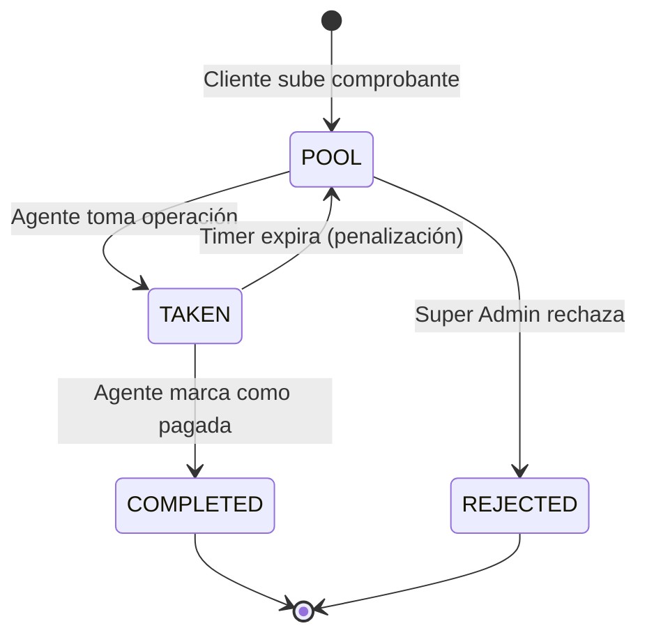

# 🧠 LÓGICA DE NEGOCIO: Fengxchange 2.0

**Fecha:** 19 de Enero de 2026
**Versión:** 3.0

---

## 1. Roles del Sistema

| Rol | Descripción | Interfaz |
|:---|:---|:---|
| **SUPER_ADMIN** | Dueño del negocio. Acceso total. Crea usuarios. Ve ganancias. | `/admin` |
| **ADMIN** | Operativo. Gestiona clientes propios. Acumula comisiones. Timer 15 min. | `/panel` |
| **CAJERO** | Limitado. Procesa operaciones de clientes propios. Timer 15 min. | `/panel` |
| **CLIENT** | Usuario final. Hace operaciones y ve historial. | `/app` |

---

## 2. Código de Agente

### Generación
- Al crear un usuario interno (ADMIN/CAJERO), se genera automáticamente un código único: `AG-XXXXX`.
- Este código es inmutable y único en el sistema.

### Asociación de Clientes
- Los clientes ingresan el código durante el registro (campo opcional).
- Si el código es válido, el cliente queda asociado (`profiles.agent_id`).

### Regla de Protección
> **Un cliente asociado SOLO puede ser atendido por:**
> 1. El agente dueño del código.
> 2. El SUPER_ADMIN.
> 
> **Otros usuarios NO pueden tomar sus operaciones.**

---

## 3. Flujo de Operación de Cambio

### 3.1. Cliente Crea Operación
1. Cliente selecciona moneda origen/destino.
2. Ingresa monto a enviar.
3. Sistema calcula monto a recibir usando tasa actual.
4. Cliente sube comprobante de pago.
5. Operación cae en el **Pool** con estado `POOL`.

### 3.2. Pool de Operaciones
- Todas las operaciones nuevas aparecen en el Pool.
- Visible para: Super Admin, Admin (solo clientes propios), Cajero (solo clientes propios).
- **Notificaciones:** WhatsApp + Email a agentes.

### 3.3. Tomar Operación
- Agente hace clic en "Tomar Operación".
- Estado cambia a `TAKEN`.
- Se registra `taken_by` y `taken_at`.
- **Timer de 15 minutos** inicia (excepto para Super Admin).

### 3.4. Procesar Pago
- Agente ejecuta el pago al beneficiario.
- Abre Modal de Pago:
  - Ingresa número de referencia.
  - Sube comprobante del pago realizado.
  - Selecciona banco/plataforma usada.
- Estado cambia a `COMPLETED`.

### 3.5. Flujo de Estados

---

## 4. Timer de 15 Minutos y Penalizaciones

### Reglas
- Al tomar una operación, inicia un contador de 15 minutos.
- **NO aplica al SUPER_ADMIN** (tiempo ilimitado).
- Aplica solo a ADMIN y CAJERO.

### Si el Timer Expira
1. Se registra **1 "Pago Demorado"** en `delayed_payments`.
2. La operación vuelve al Pool.
3. **3 Pagos Demorados en 1 mes = Descuento de $10 USD** de comisiones.

---

## 5. Sistema de Comisiones

### Cálculo
- Cuando un cliente asociado realiza una operación:
  - Ganancia = `(Tasa Venta - Tasa Compra) * Monto`.
  - **50% para el negocio** (Super Admin).
  - **50% para el agente** (Admin/Cajero).

### Acumulación
- Las comisiones se acumulan mensualmente.
- Se registran en tabla `commissions`.

### Descuentos
- 3 Pagos Demorados = -$10 USD del total mensual.

### Cierre de Mes
- Super Admin puede marcar las comisiones como "Pagadas".
- Se genera registro en `commission_history`.

---

## 6. Ganancias (Solo Super Admin)

### Motor USDT
- **Inputs:**
  - Tasa de Compra de USDT.
  - Tasa de Venta de USDT.
  - Comisión de Binance (%).
- **Cálculo:**
  - `Ganancia = (Venta - Compra) - Comisión`.

### Simulador de % de Ganancia
- Super Admin ingresa % deseado (ej: 7%).
- Sistema calcula automáticamente la tasa que debe cobrar a clientes.

---

## 7. Tasas de Cambio

### Configuración
- Super Admin o Admin pueden configurar tasas.
- Cada par de monedas tiene su tasa (ej: USD → VES = 42.50).

### Reflejo Automático
- Las tasas se muestran en:
  - Landing Page (sección de tasas).
  - Calculadora del cliente en `/app`.
  - Pool de operaciones.

### Historial
- Se guarda log de cada cambio: usuario, fecha, valor anterior, valor nuevo.

---

## 8. Bancos y Plataformas

### Tipos
- **Banco:** BCP, BBVA, Banesco, etc.
- **Plataforma:** Binance, PayPal, Zelle.

### Saldos
- Cada banco/plataforma tiene un saldo.
- **Aumenta:** Cuando cliente deposita.
- **Disminuye:** Cuando agente paga a beneficiario.

### Movimientos
- Historial de entradas/salidas por cuenta.

---

## 9. Notificaciones

### WhatsApp Business API
| Evento | Destinatario | Plantilla |
|:---|:---|:---|
| Nueva operación en Pool | Agentes | "🔔 Nueva operación #OP-XXX. Cliente: Juan. Monto: $100 USD." |
| Operación completada | Cliente | "✅ Tu envío de $100 USD ha sido procesado." |
| Comprobante | Cliente | Imagen del comprobante de pago. |

### Email
- Mismos eventos que WhatsApp.
- Plantillas HTML con diseño corporativo.

---

## 10. Chatbot IA

### WhatsApp
- Cliente escribe consulta.
- OpenAI responde con:
  - Tasas actuales.
  - Cálculos: "Si envías $50 USD, recibes X VES".
  - Horarios de atención.
  - Escalamiento a humano si no puede resolver.

### Landing Page
- Widget flotante (esquina inferior derecha).
- FAQs, proceso de envío, tasas.
