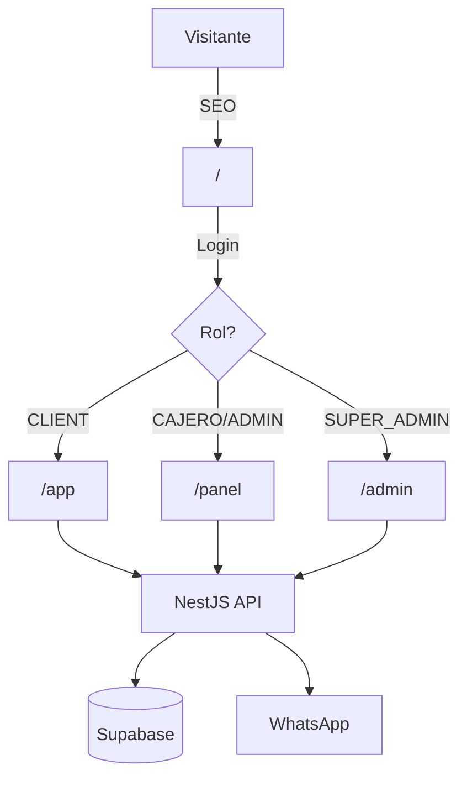

# 📘 MASTER PLAN: FENGXCHANGE SYSTEM 2.0 (Greenfield)

**Versión:** 3.0.0
**Fecha:** 19 de Enero de 2026
**Estrategia:** "Modernización Total (Greenfield) - Seguridad Primero"

Este documento unifica **TODA** la especificación técnica, de negocio, roles, integraciones y seguridad para el desarrollo de la nueva plataforma Fengxchange.

---

## 1. 🏗️ Visión y Arquitectura

### Objetivo del Proyecto
Construir una plataforma Fintech automatizada, segura y escalable para el cambio de divisas, con atención al cliente impulsada por IA, automatización vía WhatsApp, y un sistema de comisiones para agentes. **No habrá migración de datos legacy**; el sistema nace limpio (Greenfield).

> ⚠️ **REQUERIMIENTOS CRÍTICOS:**
> 1. **100% Responsive:** Todos los módulos (Landing, Cliente, Panel, Admin) deben funcionar perfectamente en móviles, tablets y desktop.
> 2. **PWA Instalable:** La aplicación debe ser instalable como app nativa desde el navegador (manifest.json, service worker, iconos).

### Tech Stack
*   **Frontend:** Next.js 15+ (App Router).
    *   **DX Tool:** `click-to-react-component-next` (Inspección de código desde el navegador).
    *   **Landing Page:** Ruta `/`.
    *   **Panel Cliente:** Ruta `/app`.
    *   **Panel Admin/Cajero:** Ruta `/panel`.
    *   **Panel Super Admin:** Ruta `/admin`.
    *   **📱 PWA (Progressive Web App):** Instalable en dispositivos móviles.
    *   **📐 100% Responsive:** Mobile-first en todos los módulos.
*   **Design System (Extraído de fengxchange.com):**
    *   **Tipografía:** `Montserrat` (Google Fonts).
        *   Títulos: `font-weight: 800-900`, hasta `50px`.
        *   Cuerpo: `font-weight: 400`, `16px`.
    *   **Paleta de Colores:**
        *   🔴 **Rojo Marca (Primary):** `#AB2820` (Logo, enlaces activos, CTAs).
        *   🔵 **Azul Marino (Hero Gradient):** `#05294F` → `#07478F` (Degradado de fondo).
        *   🍷 **Borgoña/Vino (Botones):** `#8B2E34` (Degradado en botón "Realizar Envío").
        *   ⬛ **Gris Oscuro (Texto):** `#201816` (Enlaces de menú, texto secundario).
        *   ⬜ **Gris Claro (Fondo Formulario):** `#F1F1F1`.
        *   ⚪ **Blanco Puro:** `#FFFFFF` (Títulos sobre fondo oscuro).
        *   🟢 **Verde WhatsApp:** `#25D366` (Iconos de contacto).
    *   **Estilos de Componentes:**
        *   Botones: `border-radius: 10px-15px`, degradados.
        *   Contenedores: bordes redondeados, `box-shadow` suave.
        *   Iconos sociales: circulares con colores de marca.
    *   **Framework CSS:** Tailwind CSS + ShadcnUI.
*   **Backend:** NestJS + TypeScript.
*   **Base de Datos:** Supabase (PostgreSQL 16).
*   **Auth:** Supabase Auth.
*   **Storage:** Supabase Storage.
*   **Integraciones:** WhatsApp Business API, OpenAI API.
*   **Infraestructura:** Railway + Supabase.
*   **Gestor de Paquetes:** pnpm (workspaces para monorepo).

### Arquitectura Escalable (Preparación para App Nativa)

> 📱 **PREPARADO PARA REACT NATIVE (Android + iOS)**
> La arquitectura del monorepo está diseñada para reutilizar el 80% del código cuando se desarrolle la app móvil nativa.

```
fengxchange/
├── apps/
│   ├── web/              ← Next.js (actual)
│   └── mobile/           ← React Native (futuro)
├── packages/
│   └── shared/           ← CÓDIGO COMPARTIDO
│       ├── types/        ← Interfaces TypeScript
│       ├── services/     ← API calls (AuthService, TransactionService...)
│       ├── hooks/        ← Lógica reutilizable
│       ├── utils/        ← Funciones helper
│       └── validators/   ← Schemas Zod
```

**Regla de Desarrollo:** Si NO usa componentes de UI (`div`, `span`), va en `packages/shared`.

### Diagrama de Flujo


---

## 2. 👥 Roles, Interfaces y Creación de Usuarios

### 2.1. Roles del Sistema
| Rol | Interfaz | Descripción |
| :--- | :--- | :--- |
| **SUPER_ADMIN** | `/admin` | Dueño. Acceso total. Crea usuarios internos. Ve ganancias. Puede tomar CUALQUIER operación. |
| **ADMIN** | `/panel` | Operativo. Gestiona transacciones de SUS clientes. Tiene timer de 15 min. Acumula comisiones. |
| **CAJERO** | `/panel` | Limitado. Solo procesa operaciones de SUS clientes. Tiene timer de 15 min. Acumula comisiones. |
| **CLIENT** | `/app` | Usuario final. Hace operaciones de cambio. Ve su historial. |

### 2.2. Interfaces Separadas por Rol
Cada rol tiene una interfaz visual **DIFERENTE**:
*   **`/app` (Cliente):** Dashboard personal, crear operación, historial, perfil, cuentas bancarias.
*   **`/panel` (Admin/Cajero):** Pool de Operaciones, Clientes Asociados, Historial, Comisiones, Bancos.
*   **`/admin` (Super Admin):** Todo lo de `/panel` + Ganancias, Usuarios del Sistema, Métricas Globales.

### 2.3. Creación de Usuarios Internos
*   Los **Administradores y Cajeros NO se registran públicamente**.
*   El **Super Admin** los crea desde el módulo "Usuarios" con:
    *   Email.
    *   Contraseña temporal (el usuario la cambia en su primer login).
    *   Rol asignado (ADMIN o CAJERO).
*   Al crear el usuario, se genera automáticamente un **Código de Agente** único.

---

## 3. 🎫 Código de Agente y Asociación de Clientes

### 3.1. Código de Agente
*   Cada usuario interno (ADMIN/CAJERO) tiene un **código único** (Ej: `AG-X7K2P`).
*   El código se genera automáticamente al crear el usuario.
*   Los agentes pueden compartir este código con sus clientes potenciales.

### 3.2. Registro de Clientes con Código
*   En el formulario de registro de clientes hay un campo **"Código de Agente" (opcional)**.
*   Si el cliente ingresa un código válido, queda **asociado a ese agente**.
*   Esta asociación se guarda en `profiles.agent_id`.

### 3.3. Protección de Clientes
> **REGLA CRÍTICA:** Un cliente asociado a un agente SOLO puede ser atendido por:
> 1. El propio agente (ADMIN/CAJERO dueño del código).
> 2. El SUPER_ADMIN (puede tomar cualquier operación).
> 
> **Otros usuarios NO pueden tomar operaciones de clientes que no son suyos.**

---

## 4. 📥 Pool de Operaciones

### 4.1. Concepto
Cuando un cliente envía una operación de cambio, esta cae en el **"Pool de Operaciones"** (cola central).

### 4.2. Vista del Pool
*   **Ubicación:** Sección "Pool de Operaciones" en el menú de `/panel` y `/admin`.
*   **Tabla con columnas:**
    *   Fecha/Hora, Número de Operación, Cliente, Monto Enviado, Moneda, Monto a Recibir, Banco Destino, Estado.
    *   **Vista previa del comprobante** (thumbnail de la imagen).
    *   Botón: **"Tomar Operación"**.
*   **Filtros:** Por cliente, moneda, banco, fecha.

### 4.3. Notificaciones al Pool
Cuando llega una nueva operación:
*   ✅ **WhatsApp Business:** Mensaje al teléfono de Admin/Cajero con plantilla:
    *   "🔔 Nueva operación #OP-2026-0042. Cliente: Juan Pérez. Monto: $100 USD → VES. Ver detalles en el sistema."
*   ✅ **Email:** Correo con los mismos datos y enlace directo.

### 4.4. Tomar Operación
*   Al hacer clic en "Tomar Operación", la operación queda **asignada** a ese usuario.
*   Se oculta del pool para otros usuarios.
*   **Solo el Super Admin puede tomar operaciones de clientes que no son suyos.**

---

## 5. ⏱️ Timer de 15 Minutos y Penalizaciones

### 5.1. Contador Regresivo
*   Al tomar una operación, se activa un **contador de 15 minutos** visible en pantalla.
*   Durante este tiempo, el usuario debe:
    1. Ejecutar el pago al beneficiario.
    2. Subir el comprobante de pago (Modal con upload + campo de referencia).
    3. Marcar como "Pagada".

### 5.2. Exención del Timer
> **IMPORTANTE:** El contador de 15 minutos **NUNCA** aplica al SUPER_ADMIN.
> Solo aplica a ADMIN y CAJERO.

### 5.3. Penalizaciones
*   Si el contador llega a **0** sin marcar como pagada:
    *   Se registra **1 falta de "Pago Demorado"**.
    *   La operación vuelve al pool (o queda bloqueada para revisión).
*   **3 "Pagos Demorados" en 1 mes = Descuento de $10 USD** de las comisiones del usuario.

### 5.4. Modal de Pago
*   Campos:
    *   Número de Referencia del pago.
    *   Captura/Comprobante del pago (upload imagen).
    *   Banco/Plataforma usada para pagar.
*   Al confirmar, la operación pasa a estado `COMPLETED`.

---

## 6. 💰 Sistema de Comisiones

### 6.1. Cálculo de Comisiones
*   Cuando un **cliente asociado a un agente** realiza una operación:
    *   La **ganancia** de esa transacción (diferencia entre tasa de compra y venta) se **divide al 50%**:
        *   50% para el negocio (Super Admin).
        *   50% para el agente (Admin/Cajero).
*   Las comisiones se **acumulan mensualmente**.

### 6.2. Módulo "Comisiones" en el Menú
**Vista Super Admin (`/admin/comisiones`):**
*   Tabla de todos los agentes con:
    *   Nombre, Rol, Comisiones Acumuladas (Mes), Pagos Demorados, Total Descontado.
*   Acciones: Ver historial de comisiones, Marcar como pagado (cierre de mes).

**Vista Admin/Cajero (`/panel/comisiones`):**
*   Sus propias comisiones acumuladas.
*   Número de pagos demorados del mes.
*   Historial de comisiones (filtrable por fecha, mes, trimestre, semestre, año).

### 6.3. Historial de Comisiones
*   Registro de cada comisión generada:
    *   Fecha, Operación, Cliente, Monto de Ganancia, % Asignado, Monto de Comisión.
*   Filtros: Fecha exacta, Rango de fechas, Mes, Trimestre, Semestre, Año.

---

## 7. 📜 Historial de Operaciones

### 7.1. Concepto
Registro completo de **TODAS** las operaciones:
*   Enviadas por clientes.
*   Pagadas por usuarios del sistema.

### 7.2. Vista del Historial
*   **Ubicación:** Sección "Historial" en el menú de `/panel` y `/admin`.
*   **Columnas:**
    *   Fecha, Número de Operación, Cliente, Monto Enviado/Recibido, Moneda, Banco, Estado, Procesado por.
    *   Comprobante del cliente (imagen).
    *   Comprobante del pago (imagen).

### 7.3. Filtros Avanzados
*   Por Nombre del Cliente.
*   Por Número de Documento.
*   Por País de la Transacción.
*   Por Número de Referencia.
*   Por Banco/Plataforma.
*   Por Fecha Única o Rango de Fechas.
*   Por Tipo de Moneda.
*   Por Monto (Rango Min-Max).
*   Por Estado (Pendiente, Verificando, Completada, Rechazada).

---

## 8. 📊 Otros Módulos (Resumen)

### 8.1. Dashboard (Super Admin)
*   Métricas globales, gráficos, filtros temporales (Día/Semana/Mes/Año/Rango).

### 8.2. Clientes
*   Lista de todos los clientes (o solo los asociados al agente).
*   Datos, estado KYC, operaciones.

### 8.3. Bancos y Plataformas
*   CRUD de bancos/plataformas con saldos y movimientos.

### 8.4. Ganancias (Solo Super Admin)
*   Motor USDT, simulador de % de ganancia, configuración de tasas.

### 8.5. Tasas de Cambio
*   Configuración de tasas por par de monedas.

### 8.6. Usuarios del Sistema (Solo Super Admin)
*   CRUD de admins/cajeros, asignación de roles, códigos de agente.

---

## 9. 🤖 Integraciones IA y WhatsApp

### 9.1. WhatsApp Business API
*   Notificaciones automáticas:
    *   Nueva operación en el pool.
    *   Operación completada (al cliente).
    *   Comprobante de pago (imagen adjunta).
*   Chatbot con OpenAI para consultas de clientes.

### 9.2. Chatbot en Landing Page
*   Widget flotante para FAQs, tasas en tiempo real, cálculos.

---

## 10. 🗄️ Modelo de Datos (Actualizado)

### `public.profiles`
*   `id`, `first_name`, `last_name`, `email`, `phone_number`, `country`.
*   `document_type`, `document_number`.
*   `role` (Enum: 'CLIENT', 'CAJERO', 'ADMIN', 'SUPER_ADMIN').
*   `agent_code` (Text, Unique) - Solo para ADMIN/CAJERO.
*   `agent_id` (FK -> profiles.id) - Para CLIENT, referencia al agente asociado.
*   `is_kyc_verified`, `created_at`.

### `public.transactions`
*   `id`, `transaction_number`, `user_id` (cliente), `from_currency_id`, `to_currency_id`.
*   `amount_sent`, `exchange_rate_applied`, `amount_received`.
*   `client_proof_url` (comprobante del cliente).
*   `status` (Enum: 'POOL', 'TAKEN', 'VERIFYING', 'COMPLETED', 'REJECTED').
*   `taken_by` (FK -> profiles.id) - Quién tomó la operación.
*   `taken_at` (Timestamp) - Cuándo se tomó.
*   `payment_proof_url` (comprobante del pago al beneficiario).
*   `payment_reference`, `paid_at`.
*   `created_at`, `updated_at`.

### `public.commissions`
*   `id`, `agent_id` (FK -> profiles.id), `transaction_id`.
*   `total_profit`, `commission_percent`, `commission_amount`.
*   `month`, `year`, `created_at`.

### `public.delayed_payments`
*   `id`, `agent_id`, `transaction_id`, `occurred_at`.

### `public.commission_history`
*   `id`, `agent_id`, `month`, `year`, `total_earned`, `total_deducted`, `final_amount`, `is_paid`.

---

## 11. 🛡️ Seguridad y Ciberseguridad

### 11.1. Autenticación
*   Supabase Auth con JWT. 2FA opcional para usuarios internos.

### 11.2. Autorización (RBAC)
*   Row Level Security (RLS) en Postgres.
*   Guards en NestJS por rol.
*   **Protección de clientes:** RLS impide que un agente vea clientes de otro.

### 11.3. Protección de APIs
*   Rate Limiting, Helmet.js, CORS estricto, Validación con Zod/class-validator.

### 11.4. Auditoría
*   Logs de acciones sensibles. Alertas por intentos fallidos.

### 11.5. Defensa contra Ataques
| Ataque | Mitigación |
| :--- | :--- |
| SQL Injection | Prisma ORM. |
| XSS | React + CSP. |
| CSRF | SameSite Cookies. |
| Brute Force | Rate Limiting + Bloqueo IP. |

---

## 12. 📅 Implementación (ROADMAP)

> 📝 **REGLA DE DOCUMENTACIÓN:**
> Al finalizar cada fase, se debe documentar completamente cada módulo desarrollado (funcionalidad, API endpoints, componentes, decisiones técnicas).

### Fase 1: Fundamentos (Semanas 1-4)
*   [ ] Monorepo con `packages/shared` (types, services, hooks, utils).
*   [ ] Design System (Tailwind, ShadcnUI, Montserrat).
*   [ ] Landing Page + SEO + PWA.
*   [ ] Auth + 4 interfaces por rol.
*   [ ] BD: profiles, currencies, exchange_rates, banks_platforms.
*   [ ] **📝 Documentar:** Estructura del proyecto, Design System, Auth flow.

### Fase 2: Core de Operaciones (Semanas 5-8)
*   [ ] Pool de Operaciones.
*   [ ] Sistema de "Tomar Operación" + Timer 15 min.
*   [ ] Modal de Pago + Upload de comprobante.
*   [ ] Código de Agente + Asociación de Clientes.
*   [ ] Protección de Clientes (RLS).
*   [ ] **📝 Documentar:** TransactionService, flujo de estados, RLS policies.

### Fase 3: Comisiones e Historial (Semanas 9-10)
*   [ ] Cálculo de comisiones (50%).
*   [ ] Registro de Pagos Demorados + Penalizaciones.
*   [ ] Módulo Comisiones (Super Admin + Agentes).
*   [ ] Historial con Filtros Avanzados.
*   [ ] **📝 Documentar:** CommissionService, fórmulas de cálculo, filtros.

### Fase 4: Dashboards y Ganancias (Semanas 11-12)
*   [ ] Dashboard Super Admin (Métricas, Gráficos).
*   [ ] Módulo Ganancias (USDT, Simulador).
*   [ ] Dashboard Cliente.
*   [ ] **📝 Documentar:** Métricas, queries de agregación, gráficos.

### Fase 5: Integraciones IA (Semanas 13-14)
*   [ ] WhatsApp Business (Notificaciones + Chatbot).
*   [ ] Chatbot Widget flotante (esquina inferior derecha).
*   [ ] **📝 Documentar:** Plantillas WhatsApp, prompts OpenAI, flujos de chat.

### Fase 6: Seguridad y Lanzamiento (Semana 15)
*   [ ] Hardening (RLS, Rate Limiting, 2FA).
*   [ ] Penetration Testing.
*   [ ] Producción + Go Live.
*   [ ] **📝 Documentar:** Checklist de seguridad, configuraciones de producción.

### Fase 7: App Móvil Nativa (Futuro)
*   [ ] Crear `apps/mobile` con Expo/React Native.
*   [ ] Reutilizar `packages/shared` (types, services, hooks).
*   [ ] Generar APK (Android) con `eas build --platform android`.
*   [ ] Generar IPA (iOS) con `eas build --platform ios`.
*   [ ] Publicar en Play Store y App Store.
*   [ ] **📝 Documentar:** Configuración Expo, proceso de build, publicación.
