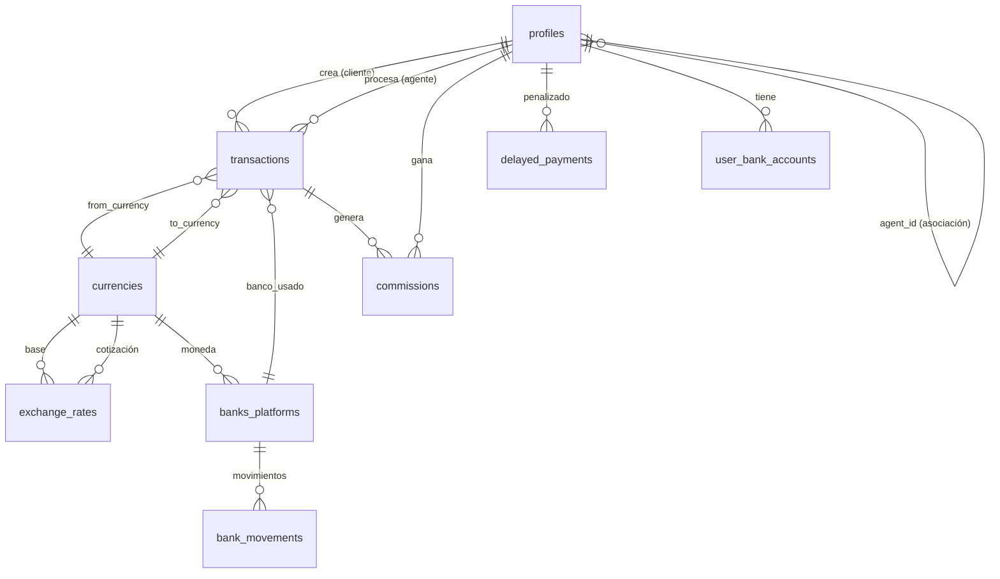

# 🗄️ MODELO DE DATOS: Fengxchange 2.0

**Fecha:** 19 de Enero de 2026
**Versión:** 3.0
**Motor:** Supabase (PostgreSQL 16)

---

## 1. Diagrama Entidad-Relación



---

## 2. Tablas del Sistema

### 2.1. `auth.users` (Supabase Auth)
Tabla nativa de Supabase para credenciales.
| Campo | Tipo | Descripción |
|:---|:---|:---|
| `id` | UUID, PK | Identificador único. |
| `email` | Text | Email del usuario. |
| `encrypted_password` | Text | Hash BCRYPT. |
| `created_at` | Timestamp | Fecha de creación. |

---

### 2.2. `public.profiles`
Extiende `auth.users` con datos de negocio.

| Campo | Tipo | Descripción |
|:---|:---|:---|
| `id` | UUID, PK, FK → auth.users | Mismo ID que auth.users. |
| `first_name` | Text | Nombre. |
| `last_name` | Text | Apellido. |
| `email` | Text | Email (duplicado para queries). |
| `phone_number` | Text | Teléfono con código de país. |
| `country` | Text | País de residencia. |
| `document_type` | Enum | 'DNI', 'PASAPORTE', 'CE'. |
| `document_number` | Text, Unique | Número de documento. |
| `role` | Enum | 'CLIENT', 'CAJERO', 'ADMIN', 'SUPER_ADMIN'. |
| `agent_code` | Text, Unique | Código de agente (solo ADMIN/CAJERO). |
| `agent_id` | UUID, FK → profiles | Agente asociado (solo CLIENT). |
| `is_kyc_verified` | Boolean | Estado de verificación. |
| `must_change_password` | Boolean | True para nuevos ADMIN/CAJERO. |
| `created_at` | Timestamp | Fecha de registro. |

**RLS:** 
- CLIENT solo ve su propio perfil.
- ADMIN/CAJERO ven sus clientes asociados.
- SUPER_ADMIN ve todos.

---

### 2.3. `public.currencies`
Catálogo de monedas.

| Campo | Tipo | Descripción |
|:---|:---|:---|
| `id` | Serial, PK | ID. |
| `code` | Text, Unique | 'USD', 'VES', 'COP', 'PEN'. |
| `name` | Text | 'Dólar Americano'. |
| `symbol` | Text | '$', 'Bs'. |
| `is_active` | Boolean | Si está disponible. |

---

### 2.4. `public.exchange_rates`
Tasas de cambio entre pares.

| Campo | Tipo | Descripción |
|:---|:---|:---|
| `id` | Serial, PK | ID. |
| `from_currency_id` | FK → currencies | Moneda origen. |
| `to_currency_id` | FK → currencies | Moneda destino. |
| `rate` | Decimal(18,8) | Valor de la tasa. |
| `updated_at` | Timestamp | Última actualización. |
| `updated_by` | FK → profiles | Quién la modificó. |

---

### 2.5. `public.banks_platforms`
Bancos y plataformas con saldos.

| Campo | Tipo | Descripción |
|:---|:---|:---|
| `id` | Serial, PK | ID. |
| `name` | Text | 'Banesco', 'Binance'. |
| `type` | Enum | 'BANK', 'PLATFORM'. |
| `currency_id` | FK → currencies | Moneda manejada. |
| `account_number` | Text | Número de cuenta. |
| `account_holder` | Text | Titular. |
| `current_balance` | Decimal(18,2) | Saldo actual. |
| `is_active` | Boolean | Si está activo. |

---

### 2.6. `public.bank_movements`
Historial de movimientos por cuenta.

| Campo | Tipo | Descripción |
|:---|:---|:---|
| `id` | UUID, PK | ID. |
| `bank_platform_id` | FK → banks_platforms | Cuenta afectada. |
| `type` | Enum | 'CREDIT', 'DEBIT'. |
| `amount` | Decimal(18,2) | Monto. |
| `transaction_id` | FK → transactions | Operación relacionada. |
| `description` | Text | Descripción. |
| `created_at` | Timestamp | Fecha. |

---

### 2.7. `public.transactions`
Operaciones de cambio.

| Campo | Tipo | Descripción |
|:---|:---|:---|
| `id` | UUID, PK | ID. |
| `transaction_number` | Text, Unique | 'OP-2026-00042'. |
| `user_id` | FK → profiles | Cliente que creó la operación. |
| `from_currency_id` | FK → currencies | Moneda que envía. |
| `to_currency_id` | FK → currencies | Moneda que recibe. |
| `amount_sent` | Decimal(18,2) | Monto enviado. |
| `exchange_rate_applied` | Decimal(18,8) | Tasa congelada. |
| `amount_received` | Decimal(18,2) | Monto calculado a recibir. |
| `client_proof_url` | Text | Comprobante del cliente. |
| `status` | Enum | 'POOL', 'TAKEN', 'COMPLETED', 'REJECTED'. |
| `taken_by` | FK → profiles | Agente que tomó la operación. |
| `taken_at` | Timestamp | Cuándo se tomó. |
| `payment_proof_url` | Text | Comprobante del pago al beneficiario. |
| `payment_reference` | Text | Referencia del pago. |
| `paid_at` | Timestamp | Cuándo se pagó. |
| `bank_platform_id` | FK → banks_platforms | Banco usado para pagar. |
| `admin_notes` | Text | Notas internas (motivo rechazo). |
| `created_at` | Timestamp | Fecha de creación. |
| `updated_at` | Timestamp | Última actualización. |

**Estados:**
- `POOL` → En cola, esperando ser tomada.
- `TAKEN` → Agente la tomó, timer corriendo.
- `COMPLETED` → Pagada exitosamente.
- `REJECTED` → Rechazada por el Super Admin.

---

### 2.8. `public.user_bank_accounts`
Cuentas bancarias de los clientes (beneficiarios).

| Campo | Tipo | Descripción |
|:---|:---|:---|
| `id` | UUID, PK | ID. |
| `user_id` | FK → profiles | Dueño de la cuenta. |
| `bank_name` | Text | Nombre del banco. |
| `account_number` | Text | Número de cuenta. |
| `account_holder` | Text | Titular. |
| `alias` | Text | 'Cuenta de Mamá'. |

---

### 2.9. `public.commissions`
Comisiones generadas por transacción.

| Campo | Tipo | Descripción |
|:---|:---|:---|
| `id` | UUID, PK | ID. |
| `agent_id` | FK → profiles | Agente que gana. |
| `transaction_id` | FK → transactions | Operación origen. |
| `total_profit` | Decimal(18,2) | Ganancia total de la operación. |
| `commission_percent` | Decimal(5,2) | 50.00. |
| `commission_amount` | Decimal(18,2) | Monto de comisión. |
| `month` | Integer | Mes (1-12). |
| `year` | Integer | Año (2026). |
| `created_at` | Timestamp | Fecha. |

---

### 2.10. `public.delayed_payments`
Registro de pagos demorados.

| Campo | Tipo | Descripción |
|:---|:---|:---|
| `id` | UUID, PK | ID. |
| `agent_id` | FK → profiles | Agente penalizado. |
| `transaction_id` | FK → transactions | Operación que expiró. |
| `occurred_at` | Timestamp | Cuándo expiró el timer. |

---

### 2.11. `public.commission_history`
Historial mensual de comisiones.

| Campo | Tipo | Descripción |
|:---|:---|:---|
| `id` | UUID, PK | ID. |
| `agent_id` | FK → profiles | Agente. |
| `month` | Integer | Mes. |
| `year` | Integer | Año. |
| `total_earned` | Decimal(18,2) | Total de comisiones. |
| `total_deducted` | Decimal(18,2) | Descuentos por demoras. |
| `final_amount` | Decimal(18,2) | Total a pagar. |
| `is_paid` | Boolean | Si ya se pagó. |
| `paid_at` | Timestamp | Fecha de pago. |

---

### 2.12. `public.profit_config`
Configuración de ganancias USDT (Solo Super Admin).

| Campo | Tipo | Descripción |
|:---|:---|:---|
| `id` | Serial, PK | ID. |
| `currency_id` | FK → currencies | Moneda. |
| `usdt_buy_rate` | Decimal(18,8) | Tasa de compra. |
| `usdt_sell_rate` | Decimal(18,8) | Tasa de venta. |
| `binance_commission_percent` | Decimal(5,2) | Comisión Binance. |
| `target_profit_percent` | Decimal(5,2) | % de ganancia deseado. |
| `calculated_client_rate` | Decimal(18,8) | Tasa calculada para clientes. |
| `updated_at` | Timestamp | Última actualización. |

---

## 3. Políticas RLS (Row Level Security)

### profiles
```sql
-- Cliente solo ve su perfil
CREATE POLICY "Clientes ven solo su perfil" ON profiles
FOR SELECT USING (auth.uid() = id OR role IN ('ADMIN', 'CAJERO', 'SUPER_ADMIN'));

-- Agente ve sus clientes asociados
CREATE POLICY "Agente ve sus clientes" ON profiles
FOR SELECT USING (agent_id = auth.uid() OR role = 'SUPER_ADMIN');
```

### transactions
```sql
-- Agente solo ve operaciones de sus clientes
CREATE POLICY "Agente ve operaciones de sus clientes" ON transactions
FOR SELECT USING (
  user_id IN (SELECT id FROM profiles WHERE agent_id = auth.uid())
  OR (SELECT role FROM profiles WHERE id = auth.uid()) = 'SUPER_ADMIN'
);
```
