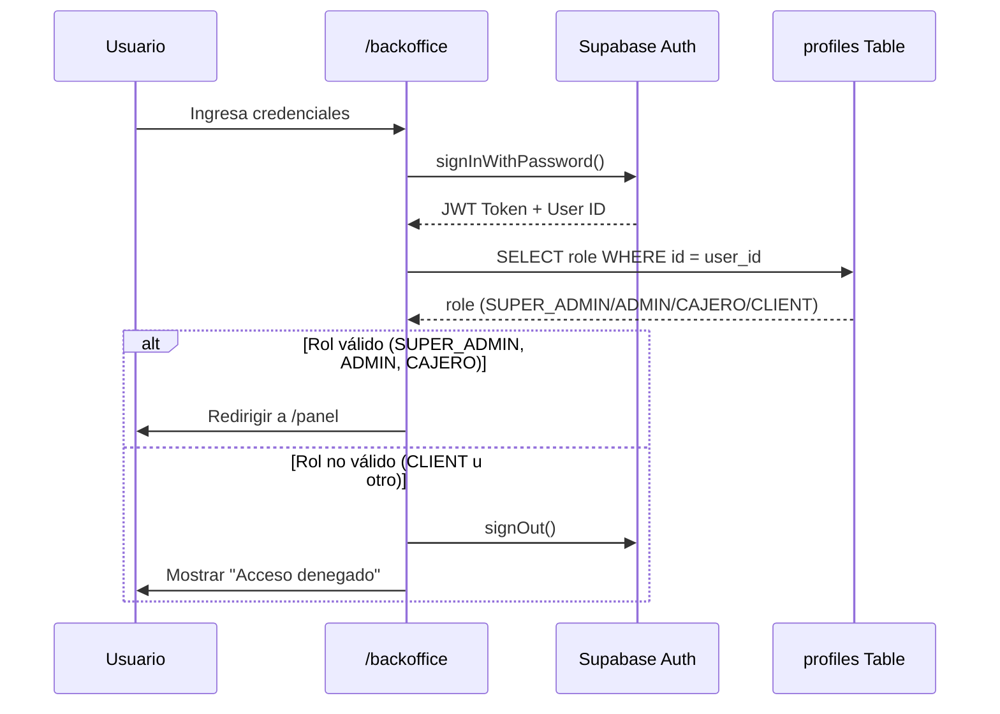

# 🔐 PANEL DE ADMINISTRACIÓN: Documentación Técnica

**Fecha de Creación:** 21 de Enero de 2026
**Última Actualización:** 21 de Enero de 2026
**Versión:** 1.0.0

---

## 1. Visión General

El Panel de Administración es el centro de control para usuarios internos de Fengxchange. Permite gestionar operaciones, usuarios, tasas de cambio, comisiones y toda la configuración del sistema.

### Roles con Acceso

| Rol | Nivel de Acceso | Descripción |
|-----|-----------------|-------------|
| **SUPER_ADMIN** | Total | Acceso completo a todas las funciones. Puede crear/editar usuarios internos. |
| **ADMIN** | Elevado | Gestiona operaciones de sus clientes asociados. Acumula comisiones. |
| **CAJERO** | Limitado | Solo procesa operaciones de sus clientes. Acumula comisiones. |

> ⚠️ **IMPORTANTE:** Los clientes (`CLIENT`) NO tienen acceso a este panel. Su acceso está restringido a `/app`.

---

## 2. Rutas y Acceso

### Desarrollo Local

```
http://localhost:3000/backoffice   → Login del panel interno
http://localhost:3000/panel        → Dashboard (requiere autenticación)
```

### Producción

**Opción A: Ruta directa (actual)**
```
https://fengxchange.com/backoffice   → Login del panel interno
https://fengxchange.com/panel        → Dashboard del panel
```

**Opción B: Subdominio (futuro, recomendado)**
```
https://panel.fengxchange.com        → Login + Dashboard
https://fengxchange.com              → Sitio público + App cliente
```

### Configuración del Subdominio en Railway (Opción B)

1. En el Dashboard de Railway → Settings → Domains
2. Agregar dominio personalizado: `panel.fengxchange.com`
3. Configurar DNS en tu proveedor de dominio:
   ```
   panel.fengxchange.com  CNAME  tu-app.up.railway.app
   ```
4. El middleware de Next.js detectará el host y mostrará la UI correspondiente

---

## 3. Seguridad

### Medidas Implementadas

- ✅ **Ruta no enlazada:** `/backoffice` no tiene ningún enlace desde la página pública
- ✅ **Validación de rol:** Al hacer login, se verifica que el usuario sea `SUPER_ADMIN`, `ADMIN` o `CAJERO`
- ✅ **Cierre de sesión automático:** Si un cliente intenta acceder, se cierra su sesión inmediatamente
- ✅ **Logging:** Todos los intentos de acceso se registran

### Medidas Futuras (Recomendadas)

- [ ] Rate limiting agresivo en `/backoffice` (máx. 5 intentos por minuto)
- [ ] 2FA obligatorio para usuarios internos
- [ ] Bloqueo de IP después de 10 intentos fallidos
- [ ] Alertas por email al Super Admin en caso de acceso sospechoso

---

## 4. Estructura de Rutas del Panel

```
/backoffice                    → Login (público, pero oculto)
/panel                         → Dashboard principal
/panel/pool                    → Pool de operaciones
/panel/operaciones             → Historial de operaciones
/panel/clientes                → Gestión de clientes
/panel/comisiones              → Comisiones y penalizaciones
/panel/bancos                  → Bancos y plataformas
/panel/tasas                   → Configuración de tasas de cambio
/panel/usuarios                → Gestión de usuarios internos (Solo SUPER_ADMIN)
/panel/ganancias               → Motor de ganancias USDT (Solo SUPER_ADMIN)
/panel/configuracion           → Configuración general
```

---

## 5. Componentes del Panel

### 5.1. Layout Principal (`/panel/layout.tsx`)
- Sidebar con navegación
- Header con perfil de usuario
- Área de contenido principal
- Responsive: Sidebar colapsable en móvil

### 5.2. Dashboard
- Métricas rápidas (operaciones pendientes, completadas, comisiones)
- Gráficos de rendimiento
- Accesos directos a secciones frecuentes

### 5.3. Pool de Operaciones
- Tabla con operaciones en estado `POOL`
- Filtros por cliente, moneda, monto, fecha
- Botón "Tomar Operación"
- Vista previa de comprobantes
- Timer de 15 minutos visible para operaciones tomadas

---

## 6. Flujos de Autenticación

### Login de Usuario Interno



---

## 7. Permisos por Rol

### SUPER_ADMIN
- ✅ Ver todas las operaciones (propias y de otros agentes)
- ✅ Tomar cualquier operación
- ✅ NO tiene timer de 15 minutos
- ✅ Ver ganancias globales
- ✅ Crear/editar/eliminar usuarios internos y asignarles roles y permisos.
- ✅ Configurar tasas de cambio
- ✅ Ver y editar comisiones de todos los agentes
- ✅ Tiene acceso a todas las secciones del panel, sin restriccion alguna.

### ADMIN
- ✅ Ver todas las operaciones de todos los clientes
- ✅ Tomar operaciones de todos los clientes, excepto las operaciones de clientes que estan asociados a otro usuario interno como por ejemplo el cajero, por medio del codigo de agente que el cliente ingrese en el formulario de registro cuando se registra por primera vez.
- ⏱️ Timer de 15 minutos activo
- ✅ Ver sus propias comisiones y no las de otros usuarios.
- ✅ Puede ver las tasas de cambio, Pero no puede editarlas.
- ❌ NO puede crear/editar/eliminar usuarios internos. (A menos que el Super Admin lo configure en la seccion de configuracion del usuario y le otorgue ese permiso, Pero jamas podrá eliminar al Super admin, ya que este debe ser intocable)
- ❌ NO puede configurar tasas de cambio.(A menos que el Super Admin lo configure en la seccion de configuracion del usuario y le otorgue ese permiso)
- ❌ NO puede ver y editar comisiones de otros usuarios.
- ❌ NO puede ver y editar bancos y plataformas.(A menos que el Super Admin lo configure en la seccion de configuracion del usuario y le otorgue ese permiso)
- ❌ NO puede ver y editar configuración general. (A menos que el Super Admin lo configure en la seccion de configuracion del usuario y le otorgue ese permiso)
- ❌ NO puede ver y editar operaciones.(A menos que el Super Admin lo configure en la seccion de configuracion del usuario y le otorgue ese permiso)
- ❌ NO puede ver y editar clientes.(A menos que el Super Admin lo configure en la seccion de configuracion del usuario y le otorgue ese permiso)
- ❌ NO puede ver y editar comisiones.(A menos que el Super Admin lo configure en la seccion de configuracion del usuario y le otorgue ese permiso)
- ❌ NO puede ver y editar ganancias.

### CAJERO
- ✅ Ver todas las operaciones de todos los clientes
- ✅ Tomar operaciones de todos los clientes, excepto las operaciones de clientes que estan asociados a otro usuario interno como por ejemplo: el administrador, por medio del codigo de agente que el cliente ingrese en el formulario de registro cuando se registra por primera vez.
- ⏱️ Timer de 15 minutos activo
- ✅ Ver sus propias comisiones pero no las de otros usuarios.
- ✅ Puede ver las tasas de cambio, Pero no puede editarlas.
- ✅ Puede ver los clientes, Pero no puede editarlos.
- ✅ Puede ver los bancos y plataformas, Pero no puede editarlos.
- ❌ NO puede crear/editar/eliminar usuarios internos.
- ❌ NO puede configurar tasas de cambio.
- ❌ NO puede ver y editar comisiones de otros usuarios.
- ❌ NO puede ver y editar configuración general.
- ❌ NO puede ver y editar ganancias.
--- 

## 8. Changelog

### v1.0.0 (21/01/2026)
- Creación inicial del documento
- Implementación de `/backoffice` login page
- Definición de estructura de rutas
- Configuración de seguridad básica

---

## 9. Referencias

- [MASTER_PLAN_FENGXCHANGE.md](./MASTER_PLAN_FENGXCHANGE.md) - Plan general del proyecto
- [MODELO_DATOS.md](./MODELO_DATOS.md) - Esquema de base de datos
- [LOGICA_NEGOCIO.md](./LOGICA_NEGOCIO.md) - Reglas de negocio
