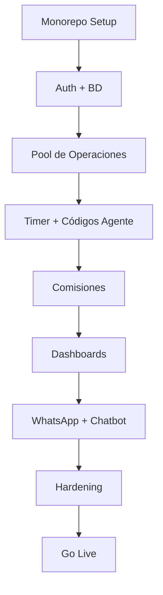

# 📅 ROADMAP DE IMPLEMENTACIÓN: Fengxchange 2.0

**Fecha:** 19 de Enero de 2026
**Versión:** 3.0
**Duración Estimada:** 15 Semanas

---

## Resumen de Fases

| Fase | Nombre | Semanas | Entregables Clave |
|:---:|:---|:---:|:---|
| 1 | Fundamentos | 1-4 | Monorepo, Auth, Landing, BD |
| 2 | Core de Operaciones | 5-8 | Pool, Timer, Códigos Agente |
| 3 | Comisiones e Historial | 9-10 | Comisiones 50%, Penalizaciones |
| 4 | Dashboards y Ganancias | 11-12 | Métricas, Motor USDT |
| 5 | Integraciones IA | 13-14 | WhatsApp, Chatbot |
| 6 | Seguridad y Lanzamiento | 15 | Hardening, Go Live |

---

## Fase 1: Fundamentos (Semanas 1-4)

### Semana 1-2: Setup Técnico
- [ ] Inicializar Monorepo con Turborepo.
- [ ] Configurar `apps/web` (Next.js 14).
- [ ] Configurar `apps/api` (NestJS).
- [ ] Crear proyecto Supabase.
- [ ] Configurar Railway (staging).

### Semana 2-3: Design System y Landing
- [ ] Configurar Tailwind CSS.
- [ ] Implementar paleta de colores (`#AB2820`, `#05294F`, etc.).
- [ ] Instalar fuente Montserrat.
- [ ] Clonar Landing Page de `fengxchange.com`.
- [ ] Implementar SEO (sitemap, robots, meta tags).
- [ ] Widget de Chatbot (placeholder).

### Semana 3-4: Auth y BD Base
- [ ] Configurar Supabase Auth.
- [ ] Crear tabla `profiles` con roles.
- [ ] Crear tabla `currencies`.
- [ ] Crear tabla `exchange_rates`.
- [ ] Implementar 4 interfaces por rol (`/app`, `/panel`, `/admin`).
- [ ] Flujo de login/registro.
- [ ] Campo "Código de Agente" en registro.

---

## Fase 2: Core de Operaciones (Semanas 5-8)

### Semana 5-6: Pool de Operaciones
- [ ] Crear tabla `transactions`.
- [ ] Crear tabla `banks_platforms`.
- [ ] Implementar creación de operación (cliente).
- [ ] Implementar Pool de Operaciones (vista tabla).
- [ ] Filtros del Pool.
- [ ] Vista previa de comprobantes.

### Semana 6-7: Tomar Operación y Timer
- [ ] Botón "Tomar Operación".
- [ ] Campos `taken_by` y `taken_at`.
- [ ] Implementar Timer de 15 minutos.
- [ ] Exención del timer para Super Admin.
- [ ] Lógica de expiración (volver al pool).

### Semana 7-8: Modal de Pago y Protección
- [ ] Modal de subida de comprobante de pago.
- [ ] Campos de referencia y banco.
- [ ] Cambio de estado a COMPLETED.
- [ ] Crear tabla `delayed_payments`.
- [ ] Generación de Código de Agente.
- [ ] Asociación cliente-agente.
- [ ] RLS para protección de clientes.

---

## Fase 3: Comisiones e Historial (Semanas 9-10)

### Semana 9: Sistema de Comisiones
- [ ] Crear tabla `commissions`.
- [ ] Cálculo automático al completar operación (50%).
- [ ] Crear tabla `commission_history`.
- [ ] Módulo Comisiones (Super Admin: ver todos).
- [ ] Módulo Comisiones (Agente: ver propias).

### Semana 10: Penalizaciones e Historial
- [ ] Lógica de 3 demoras = -$10 USD.
- [ ] Descuento automático de comisiones.
- [ ] Historial de Operaciones (vista global).
- [ ] Filtros avanzados del historial.
- [ ] Exportación a CSV (opcional).

---

## Fase 4: Dashboards y Ganancias (Semanas 11-12)

### Semana 11: Dashboards
- [ ] Dashboard Super Admin con métricas.
- [ ] Gráficos: operaciones por día, distribución por moneda.
- [ ] Filtros temporales (día/semana/mes/año/rango).
- [ ] Dashboard Cliente (historial personal).

### Semana 12: Motor de Ganancias
- [ ] Crear tabla `profit_config`.
- [ ] Configuración de tasas USDT (compra/venta).
- [ ] Simulador de % de ganancia deseado.
- [ ] Cálculo automático de tasa para clientes.
- [ ] Reflejo en Landing y Calculadora.

---

## Fase 5: Integraciones IA (Semanas 13-14)

### Semana 13: WhatsApp Business
- [ ] Conectar API de WhatsApp Business.
- [ ] Template: Nueva operación en pool.
- [ ] Template: Operación completada.
- [ ] Envío de comprobantes como imagen.
- [ ] Configurar números de agentes.

### Semana 14: Chatbot OpenAI
- [ ] Integrar OpenAI API.
- [ ] Chatbot WhatsApp: consultas de tasas.
- [ ] Chatbot WhatsApp: cálculos de cambio.
- [ ] Widget de Chat en Landing (esquina inferior derecha).
- [ ] FAQs y proceso de envío.

---

## Fase 6: Seguridad y Lanzamiento (Semana 15)

### Hardening
- [ ] Revisar RLS en todas las tablas.
- [ ] Configurar Rate Limiting (100 req/min).
- [ ] Habilitar 2FA opcional para usuarios internos.
- [ ] Implementar logs de auditoría.
- [ ] Alertas por intentos fallidos.

### Testing
- [ ] Test de roles y permisos.
- [ ] Test de flujo de operación.
- [ ] Test de comisiones.
- [ ] Test de timer y penalizaciones.
- [ ] Penetration Testing manual.

### Lanzamiento
- [ ] Configurar dominio de producción en Railway.
- [ ] DNS: `fengxchange.com` → Railway.
- [ ] Verificar SSL.
- [ ] Crear usuario Super Admin inicial.
- [ ] **Go Live.**

---

## Dependencias Críticas

---

## Riesgos y Mitigaciones

| Riesgo | Probabilidad | Impacto | Mitigación |
|:---|:---:|:---:|:---|
| API WhatsApp rechazada | Media | Alta | Tener backup con Twilio. |
| Complejidad RLS | Media | Media | Pruebas exhaustivas de permisos. |
| Timer bugs | Baja | Alta | Tests automatizados. |
| Sobrecostos IA | Baja | Baja | Límites de uso en OpenAI. |
