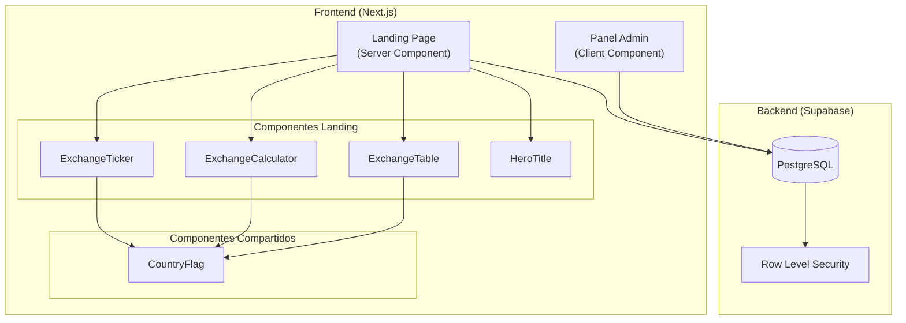
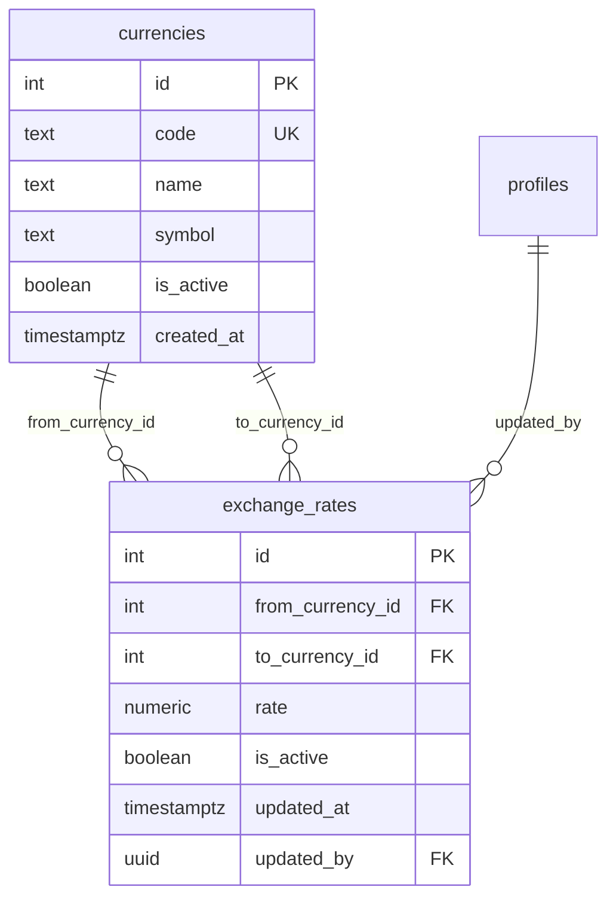
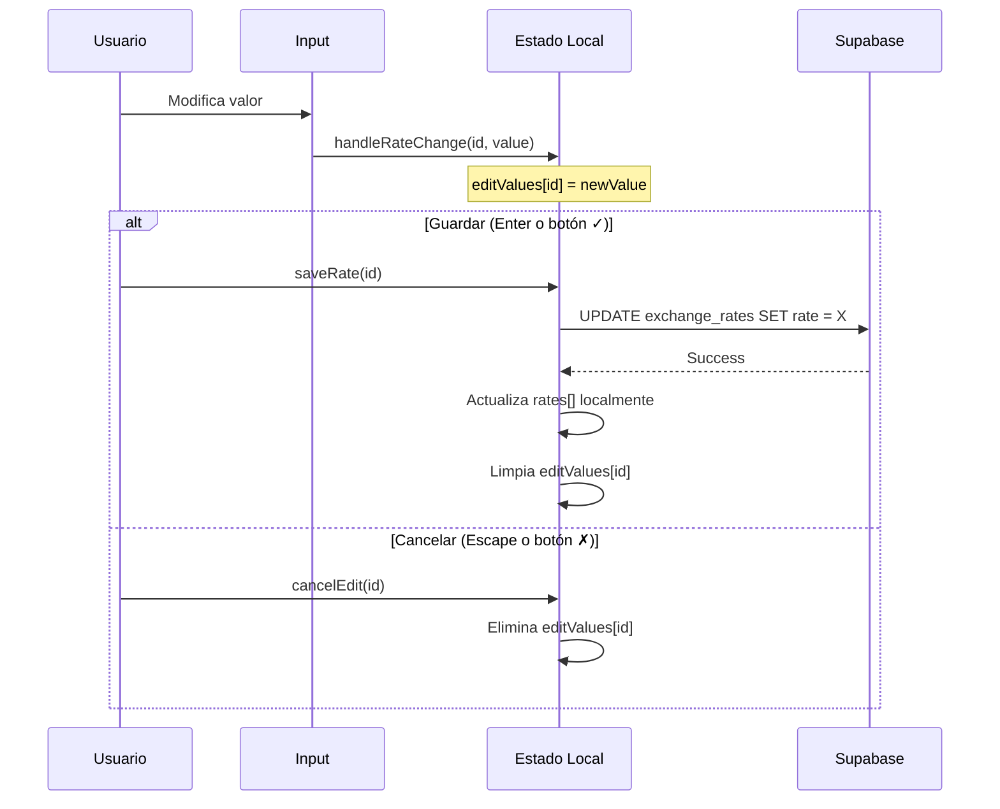
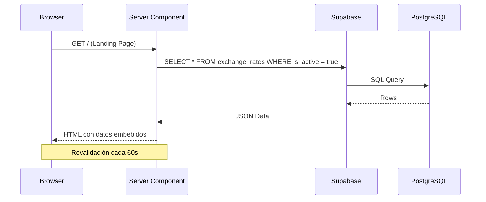
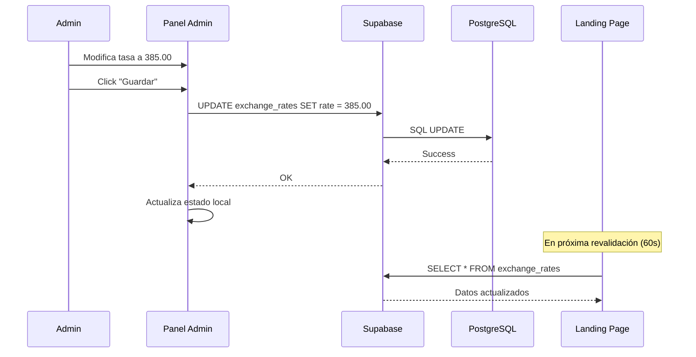
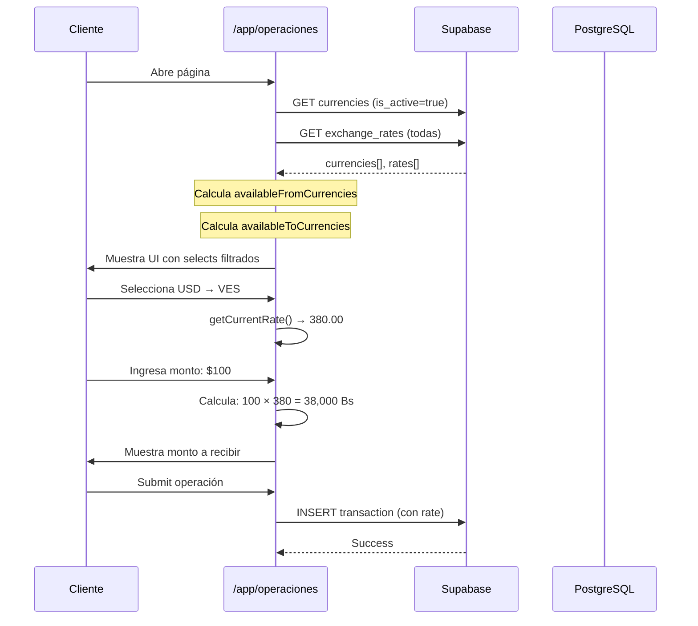

# Sistema de Gestión de Tasas de Cambio

> **Manual Técnico Completo**  
> Última actualización: enero 2026

---

## Tabla de Contenidos

1. [Descripción General](#1-descripción-general)
2. [Arquitectura del Sistema](#2-arquitectura-del-sistema)
3. [Base de Datos](#3-base-de-datos)
4. [Componentes Frontend](#4-componentes-frontend)
5. [Flujos de Datos](#5-flujos-de-datos)
6. [Seguridad (RLS)](#6-seguridad-rls)
7. [Tipos TypeScript](#7-tipos-typescript)
8. [Animaciones CSS](#8-animaciones-css)
9. [Guía de Mantenimiento](#9-guía-de-mantenimiento)
10. [Integración con Página de Operaciones](#10-integración-con-página-de-operaciones-cliente)

---

## 1. Descripción General

El Sistema de Gestión de Tasas permite administrar las tasas de cambio entre pares de monedas de manera centralizada. Implementa una arquitectura moderna basada en **React Server Components (RSC)** para optimizar el rendimiento y SEO.

### Características Principales

| Característica | Descripción |
|----------------|-------------|
| **Administración en tiempo real** | Edición inline de tasas desde el panel admin |
| **Activación/Desactivación** | Control de visibilidad de pares de monedas |
| **Ticker animado** | Muestra tasas en bucle infinito en la landing |
| **Calculadora interactiva** | Permite calcular conversiones al instante |
| **SEO optimizado** | Data fetching en servidor con revalidación |
| **Seguridad RLS** | Control de acceso a nivel de fila en PostgreSQL |

---

## 2. Arquitectura del Sistema



### Estructura de Archivos

```
feng-x-change-app/
├── apps/web/src/
│   ├── app/
│   │   ├── page.tsx                    # Landing Page (RSC)
│   │   ├── globals.css                 # Animaciones CSS
│   │   └── panel/tasas/
│   │       └── page.tsx                # Panel Admin de Tasas
│   │
│   ├── components/
│   │   ├── home/
│   │   │   ├── ExchangeTicker.tsx      # Ticker animado
│   │   │   ├── ExchangeCalculator.tsx  # Calculadora de envíos
│   │   │   ├── ExchangeTable.tsx       # Tabla de tasas
│   │   │   └── HeroTitle.tsx           # Título animado
│   │   │
│   │   └── ui/
│   │       └── CountryFlag.tsx         # Componente de banderas
│   │
│   └── public/flags/
│       ├── ve.svg                      # Venezuela
│       ├── co.svg                      # Colombia
│       ├── pe.svg                      # Perú
│       ├── cl.svg                      # Chile
│       ├── pa.svg                      # Panamá
│       ├── us.svg                      # Estados Unidos
│       └── eu.svg                      # Unión Europea
│
└── packages/shared/src/types/
    ├── currency.ts                     # Tipo Currency
    └── exchange-rate.ts                # Tipo ExchangeRate
```

---

## 3. Base de Datos

### 3.1 Tabla `currencies`

Catálogo de monedas disponibles en el sistema.

| Columna | Tipo | Nullable | Default | Descripción |
|---------|------|----------|---------|-------------|
| `id` | `SERIAL` | NO | autoincrement | Primary Key |
| `code` | `TEXT` | NO | - | Código ISO (USD, VES, COP, etc.) - **UNIQUE** |
| `name` | `TEXT` | NO | - | Nombre completo de la moneda |
| `symbol` | `TEXT` | NO | - | Símbolo ($ , Bs, €, etc.) |
| `is_active` | `BOOLEAN` | NO | `true` | Si la moneda está disponible |
| `created_at` | `TIMESTAMPTZ` | NO | `now()` | Fecha de creación |

#### Datos Actuales

| id | code | name | symbol |
|----|------|------|--------|
| 1 | USD | Dólar Americano | $ |
| 2 | VES | Bolívar Venezolano | Bs |
| 3 | COP | Peso Colombiano | COP |
| 4 | PEN | Sol Peruano | S/ |
| 5 | CLP | Peso Chileno | CLP |
| 6 | EUR | Euro | € |
| 7 | PAB | Balboa Panameño | B/. |

---

### 3.2 Tabla `exchange_rates`

Almacena las tasas de cambio entre pares de monedas.

| Columna | Tipo | Nullable | Default | Descripción |
|---------|------|----------|---------|-------------|
| `id` | `SERIAL` | NO | autoincrement | Primary Key |
| `from_currency_id` | `INTEGER` | NO | - | FK → currencies.id (moneda origen) |
| `to_currency_id` | `INTEGER` | NO | - | FK → currencies.id (moneda destino) |
| `rate` | `NUMERIC(18,8)` | NO | - | Valor de la tasa de cambio |
| `is_active` | `BOOLEAN` | YES | `true` | Si el par está activo para operaciones |
| `updated_at` | `TIMESTAMPTZ` | NO | `now()` | Última actualización |
| `updated_by` | `UUID` | YES | - | FK → profiles.id (quién modificó) |

#### Relaciones



#### Ejemplo de Datos

| id | from_currency_id | to_currency_id | rate | is_active |
|----|------------------|----------------|------|-----------|
| 1 | 1 (USD) | 2 (VES) | 380.00 | true |
| 2 | 1 (USD) | 3 (COP) | 4200.00 | true |
| 3 | 1 (USD) | 4 (PEN) | 3.85 | true |
| 4 | 1 (USD) | 5 (CLP) | 1000.00 | true |

---

## 4. Componentes Frontend

### 4.1 Landing Page (`apps/web/src/app/page.tsx`)

**Tipo:** React Server Component (RSC)

```typescript
// Revalidación cada 60 segundos
export const revalidate = 60;

export default async function HomePage() {
  // Data fetching en el servidor
  const { data: exchangeRates } = await supabase
    .from('exchange_rates')
    .select(`
      *,
      from_currency:currencies!exchange_rates_from_currency_id_fkey(code, name, symbol),
      to_currency:currencies!exchange_rates_to_currency_id_fkey(code, name, symbol)
    `)
    .eq('is_active', true)
    .order('id', { ascending: true });

  return (
    <>
      <ExchangeTicker rates={rates} />
      <ExchangeCalculator rates={rates} />
      <ExchangeTable rates={rates} />
    </>
  );
}
```

**Características:**
- Data fetching asíncrono en el servidor (sin waterfalls)
- Revalidación automática cada 60 segundos
- Las tasas se ordenan por `id` para mantener consistencia
- Solo muestra tasas activas (`is_active = true`)

---

### 4.2 Panel Admin (`apps/web/src/app/panel/tasas/page.tsx`)

**Tipo:** Client Component  
**Ruta:** `/panel/tasas`

#### Funcionalidades

| Función | Descripción |
|---------|-------------|
| `fetchRates()` | Obtiene todas las tasas con monedas relacionadas |
| `handleRateChange(id, value)` | Actualiza el valor local durante edición |
| `saveRate(id)` | Persiste el cambio en Supabase |
| `toggleActive(id, currentState)` | Activa/desactiva un par de monedas |
| `cancelEdit(id)` | Cancela la edición en progreso |

#### Estados del Componente

```typescript
const [rates, setRates] = useState<ExchangeRate[]>([]);
const [loading, setLoading] = useState(true);
const [updating, setUpdating] = useState<number | null>(null);
const [searchTerm, setSearchTerm] = useState('');
const [activeFilter, setActiveFilter] = useState<string | 'ALL'>('ALL');
const [editValues, setEditValues] = useState<Record<number, string>>({});
```

#### Flujo de Edición Inline



---

### 4.3 ExchangeTicker (`apps/web/src/components/home/ExchangeTicker.tsx`)

**Tipo:** Client Component  
**Propósito:** Mostrar tasas en un banner animado de scroll infinito.

```typescript
interface ExchangeTickerProps {
  rates: ExchangeRate[];
  loading?: boolean;
}
```

#### Estructura del Marquee

El ticker usa **dos bloques idénticos** para crear un efecto de bucle infinito:

```tsx
<div className="animate-marquee whitespace-nowrap flex w-max">
  {/* Bloque 1: Contenido original */}
  <div className="flex items-center gap-12 pr-12">
    {rates.map((rate, i) => (
      <span key={`original-${i}`}>...</span>
    ))}
  </div>
  
  {/* Bloque 2: Copia para continuidad */}
  <div className="flex items-center gap-12 pr-12">
    {rates.map((rate, i) => (
      <span key={`copy-${i}`}>...</span>
    ))}
  </div>
</div>
```

---

### 4.4 ExchangeCalculator (`apps/web/src/components/home/ExchangeCalculator.tsx`)

**Tipo:** Client Component  
**Propósito:** Calculadora interactiva para simular conversiones.

#### Estados

```typescript
const [fromCurrencyCode, setFromCurrencyCode] = useState('USD');
const [toCurrencyCode, setToCurrencyCode] = useState('VES');
const [amount, setAmount] = useState('100');
```

#### Lógica de Cálculo

```typescript
const currentRateObj = rates.find(
  r => r.from_currency.code === fromCurrencyCode && 
       r.to_currency.code === toCurrencyCode
);
const currentRate = currentRateObj?.rate || 0;
const receivedAmount = (parseFloat(amount) || 0) * currentRate;
```

---

### 4.5 ExchangeTable (`apps/web/src/components/home/ExchangeTable.tsx`)

**Tipo:** Client Component  
**Propósito:** Tabla interactiva con tabs por moneda origen.

#### Características

- **Tabs dinámicos:** Se generan automáticamente según monedas origen únicas
- **Inputs editables:** Cada fila permite cambiar el monto a enviar
- **Cálculo en tiempo real:** El monto recibido se actualiza instantáneamente

---

### 4.6 CountryFlag (`apps/web/src/components/ui/CountryFlag.tsx`)

**Tipo:** Server Component (sin `'use client'`)  
**Propósito:** Renderizar banderas de países y plataformas de pago.

#### Mapeo de Códigos

```typescript
const currencyToFlagMap: Record<string, string> = {
  'VES': 'VE', 'COP': 'CO', 'PEN': 'PE',
  'CLP': 'CL', 'PAB': 'PA', 'USD': 'US', 'EUR': 'EU',
  // Mapeos directos
  'VE': 'VE', 'CO': 'CO', 'PE': 'PE',
  'CL': 'CL', 'PA': 'PA', 'US': 'US', 'EU': 'EU'
};
```

#### Banderas de Países (SVG externos)

```typescript
const countryFlags: Record<string, string> = {
  VE: '/flags/ve.svg',
  CO: '/flags/co.svg',
  PE: '/flags/pe.svg',
  CL: '/flags/cl.svg',
  PA: '/flags/pa.svg',
  US: '/flags/us.svg',
  EU: '/flags/eu.svg',
};
```

#### Iconos de Plataformas (SVG inline)

- `PAYPAL`: Fondo azul (#003087)
- `ZINLI`: Gradiente púrpura-rosa
- `ZELLE`: Fondo púrpura (#6D1ED4)
- `USDT`: Fondo verde (#26A17B)

---

## 5. Flujos de Datos

### 5.1 Consulta de Tasas (Landing Page)



### 5.2 Actualización de Tasa (Panel Admin)



---

## 6. Seguridad (RLS)

### Tabla `currencies`

| Política | Comando | Condición |
|----------|---------|-----------|
| Lectura pública de monedas | `SELECT` | `true` (sin restricción) |

### Tabla `exchange_rates`

| Política | Comando | Condición |
|----------|---------|-----------|
| Lectura pública de tasas | `SELECT` | `true` |
| Public Read Access | `SELECT` | `true` |
| Admin Write Access | `ALL` | `auth.role() = 'authenticated'` |
| Admin modifica tasas | `ALL` | `profiles.role IN ('ADMIN', 'SUPER_ADMIN')` |

> [!IMPORTANT]
> Solo usuarios con rol `ADMIN` o `SUPER_ADMIN` pueden modificar las tasas.

---

## 7. Tipos TypeScript

### Currency (`packages/shared/src/types/currency.ts`)

```typescript
export interface Currency {
  id: number;
  code: string;      // "USD", "VES", etc.
  name: string;      // "Dólar Americano"
  symbol: string;    // "$", "Bs"
  is_active: boolean;
}

export interface CreateCurrencyInput {
  code: string;
  name: string;
  symbol: string;
  is_active?: boolean;
}

export interface UpdateCurrencyInput {
  name?: string;
  symbol?: string;
  is_active?: boolean;
}
```

### ExchangeRate (`packages/shared/src/types/exchange-rate.ts`)

```typescript
export interface ExchangeRate {
  id: number;
  from_currency_id: number;
  to_currency_id: number;
  rate: number;
  updated_at: string;
  updated_by: string;
}

export interface ExchangeRateWithCurrencies extends ExchangeRate {
  from_currency: Currency;
  to_currency: Currency;
}

export interface UpsertExchangeRateInput {
  from_currency_id: number;
  to_currency_id: number;
  rate: number;
}

export interface ExchangeRateHistory {
  id: number;
  exchange_rate_id: number;
  old_rate: number;
  new_rate: number;
  changed_by: string;
  changed_at: string;
}
```

---

## 8. Animaciones CSS

### Archivo: `apps/web/src/app/globals.css`

```css
/* Animación del Ticker de Tasas */
@keyframes marquee {
  0% { transform: translateX(0); }
  100% { transform: translateX(-50%); }
}

.animate-marquee {
  animation: marquee 200s linear infinite;
}

/* Animación alternativa (más lenta) */
@keyframes marquee-slow {
  0% { transform: translateX(0); }
  100% { transform: translateX(-50%); }
}

.animate-marquee-slow {
  animation: marquee-slow 60s linear infinite;
}
```

> [!NOTE]
> La duración de 200s fue seleccionada para una velocidad legible del ticker.  
> El `translateX(-50%)` funciona porque se duplican los elementos.

---

## 10. Integración con Página de Operaciones (Cliente)

### Ubicación
`apps/web/src/app/app/operaciones/page.tsx`

**Tipo:** Client Component  
**Ruta:** `/app/operaciones`  
**Propósito:** Permite a los clientes crear operaciones de cambio usando las tasas del sistema.

### 10.1 Carga de Tasas

La página carga las tasas en el hook `useEffect` inicial:

```typescript
const loadData = async () => {
  // Cargar monedas activas
  const { data: currenciesData } = await supabase
    .from('currencies')
    .select('*')
    .eq('is_active', true)
    .order('id');

  // Cargar TODAS las tasas de cambio
  const { data: ratesData } = await supabase
    .from('exchange_rates')
    .select('*');

  if (currenciesData) setCurrencies(currenciesData);
  if (ratesData) setExchangeRates(ratesData);
};
```

> [!NOTE]
> A diferencia de la Landing Page (que solo carga `is_active = true`), la página de operaciones carga todas las tasas para manejar casos edge.

### 10.2 Filtrado de Monedas Disponibles

Las monedas disponibles se calculan dinámicamente basándose en las tasas configuradas:

```typescript
// Monedas ORIGEN: solo las que tienen al menos una tasa configurada
const availableFromCurrencies = currencies.filter(c =>
  exchangeRates.some(r => r.from_currency_id === c.id)
);

// Monedas DESTINO: dependen de la moneda origen seleccionada
const availableToCurrencies = currencies.filter(c =>
  exchangeRates.some(r => 
    r.from_currency_id === fromCurrencyId && 
    r.to_currency_id === c.id
  )
);
```

### 10.3 Cálculo de Tasa Actual

La función `getCurrentRate()` busca la tasa para el par origen-destino seleccionado:

```typescript
const getCurrentRate = useCallback(() => {
  const rate = exchangeRates.find(
    r => r.from_currency_id === fromCurrencyId && 
         r.to_currency_id === toCurrencyId
  );
  return rate?.rate || 0;
}, [exchangeRates, fromCurrencyId, toCurrencyId]);
```

### 10.4 UI de Selección de Monedas

Los selects de moneda origen y destino filtran automáticamente las opciones:

```tsx
{/* Selector Moneda Origen (líneas 596-606) */}
<select
  value={fromCurrencyId}
  onChange={(e) => setFromCurrencyId(parseInt(e.target.value))}
  className="input"
>
  {availableFromCurrencies.map(currency => (
    <option key={currency.id} value={currency.id}>
      {currency.symbol} {currency.code} - {currency.name}
    </option>
  ))}
</select>

{/* Selector Moneda Destino */}
<select
  value={toCurrencyId}
  onChange={(e) => setToCurrencyId(parseInt(e.target.value))}
  className="input"
>
  {availableToCurrencies.map(currency => (
    <option key={currency.id} value={currency.id}>
      {currency.symbol} {currency.code} - {currency.name}
    </option>
  ))}
</select>
```

### 10.5 Ajuste Automático de Moneda Seleccionada

Si el usuario cambia la moneda origen y la moneda destino actual no tiene tasa configurada, se selecciona automáticamente otra disponible:

```typescript
useEffect(() => {
  // Si la moneda origen no está disponible, seleccionar primera
  if (availableFromCurrencies.length > 0 && 
      !availableFromCurrencies.find(c => c.id === fromCurrencyId)) {
    setFromCurrencyId(availableFromCurrencies[0].id);
  }
}, [availableFromCurrencies, fromCurrencyId]);

useEffect(() => {
  // Si la moneda destino no está disponible para este origen, seleccionar primera
  if (availableToCurrencies.length > 0 && 
      !availableToCurrencies.find(c => c.id === toCurrencyId)) {
    setToCurrencyId(availableToCurrencies[0].id);
  }
}, [fromCurrencyId, availableToCurrencies, toCurrencyId]);
```

### 10.6 Flujo Completo de Datos



### 10.7 Mapeos de Código de Moneda a País

Para determinar tipos de documento y filtrar bancos por país:

```typescript
const currencyToCountryMap: Record<string, string> = {
  'VES': 'VE', 'COP': 'CO', 'PEN': 'PE',
  'CLP': 'CL', 'PAB': 'PA', 'USD': 'US', 'EUR': 'EU',
};

// Se usa para:
const toCountryCode = currencyToCountryMap[toCurrencyCode] || 'VE';
const documentTypesForCurrency = documentTypesByCountry[toCountryCode];
const availableBanks = banks.filter(b => b.currency_code === toCurrencyCode);
```

### 10.8 Diferencias con Landing Page

| Aspecto | Landing Page | Página Operaciones |
|---------|--------------|-------------------|
| Tipo componente | Server Component (RSC) | Client Component |
| Fetch de tasas | `is_active = true` | Todas las tasas |
| Revalidación | 60 segundos (servidor) | Manual (al cargar) |
| Propósito | Mostrar información | Crear transacciones |
| Cálculo | Solo visual | Usado para operación real |

---

## Apéndice: Consultas SQL Útiles

### Agregar una Nueva Moneda

1. **Insertar en `currencies`:**
   ```sql
   INSERT INTO currencies (code, name, symbol, is_active)
   VALUES ('BRL', 'Real Brasileño', 'R$', true);
   ```

2. **Agregar bandera SVG:**
   - Subir archivo a `apps/web/public/flags/br.svg`
   - Actualizar `CountryFlag.tsx`:
     ```typescript
     const currencyToFlagMap = {
       // ...existentes
       'BRL': 'BR',
       'BR': 'BR'
     };
     
     const countryFlags = {
       // ...existentes
       BR: '/flags/br.svg',
     };
     ```

3. **Crear pares de tasas:**
   ```sql
   INSERT INTO exchange_rates (from_currency_id, to_currency_id, rate)
   VALUES ((SELECT id FROM currencies WHERE code = 'USD'),
           (SELECT id FROM currencies WHERE code = 'BRL'),
           5.50);
   ```

### Modificar Velocidad del Ticker

Editar en `globals.css`:

```css
.animate-marquee {
  animation: marquee 200s linear infinite; /* Ajustar segundos */
}
```

| Duración | Velocidad |
|----------|-----------|
| 100s | Rápida |
| 200s | Normal (actual) |
| 300s | Lenta |

### Depuración Común

| Problema | Solución |
|----------|----------|
| Tasas no se actualizan en landing | Esperar revalidación (60s) o forzar rebuild |
| Bandera no aparece | Verificar que existe el SVG en `/public/flags/` y el mapeo en `CountryFlag.tsx` |
| Error de RLS al editar | Verificar que el usuario tiene rol ADMIN/SUPER_ADMIN |
| Ticker con "salto" | Asegurar que existen 2 bloques de contenido duplicados |

---

## Apéndice: Consultas SQL Útiles

```sql
-- Ver todas las tasas con nombres de monedas
SELECT 
  er.id,
  fc.code as from_code,
  fc.name as from_name,
  tc.code as to_code,
  tc.name as to_name,
  er.rate,
  er.is_active,
  er.updated_at
FROM exchange_rates er
JOIN currencies fc ON er.from_currency_id = fc.id
JOIN currencies tc ON er.to_currency_id = tc.id
ORDER BY er.id;

-- Actualizar tasa específica
UPDATE exchange_rates 
SET rate = 400.00, updated_at = now()
WHERE from_currency_id = 1 AND to_currency_id = 2;

-- Desactivar un par de monedas
UPDATE exchange_rates 
SET is_active = false 
WHERE from_currency_id = 1 AND to_currency_id = 6;

-- Ver políticas RLS activas
SELECT * FROM pg_policies 
WHERE tablename IN ('exchange_rates', 'currencies');
```

---

> **Documento generado automáticamente**  
> Para actualizaciones, contactar al equipo de desarrollo.
